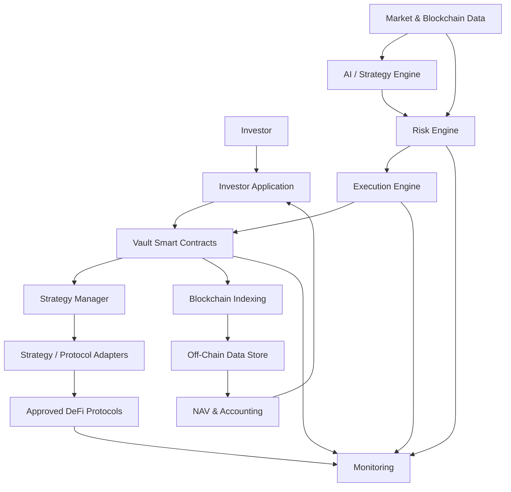
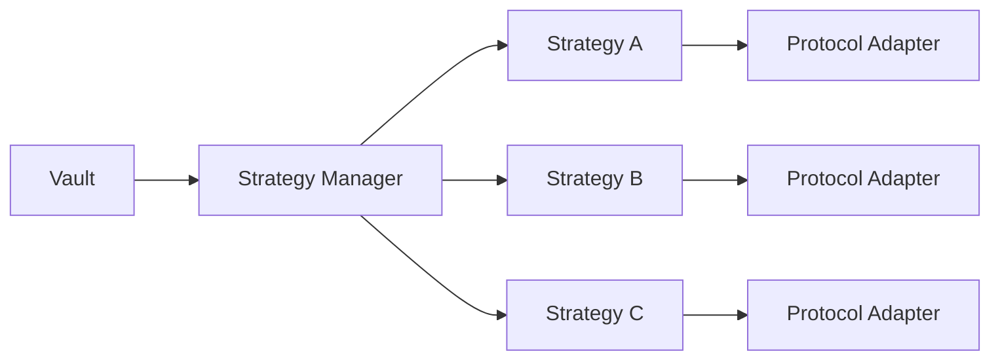
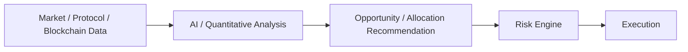
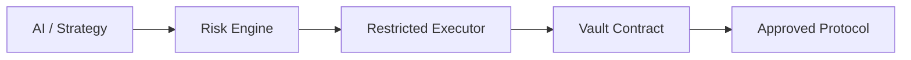

# AI-Driven DeFi Multi-Strategy Vault

## Technical Architecture & System Design

**Document Status:** Draft / High-Level Architecture

**Version:** 1.0

---

## 1. Purpose

This document presents a proposed high-level technical architecture for the AI-driven, non-custodial DeFi multi-strategy vault described in the Product & Engineering Brief.

The purpose at this stage is to establish:

* Core system components.
* Responsibilities of each component.
* Interaction between on-chain and off-chain systems.
* General strategy architecture.
* AI and risk-engine integration.
* Non-custodial architecture.
* Security principles.
* Key technical considerations.
* Architecture decisions that require further clarification.

Specific blockchain networks, DeFi protocols, AI providers, data providers, strategy parameters, and infrastructure providers are **not assumed at this stage** and will be finalized during the detailed architecture phase.

---

# 2. Architectural Objectives

The architecture should support:

* Non-custodial investor funds.
* Multiple DeFi investment strategies.
* Automated strategy allocation.
* AI-assisted opportunity identification.
* Deterministic risk controls.
* Transparent investor-level accounting.
* NAV calculation.
* Strategy-level performance attribution.
* On-chain transaction transparency.
* Emergency controls.
* Progressive introduction of strategies.
* Future multi-chain support.

The primary design principle is:

> **Capital preservation first, risk-adjusted returns second, and opportunistic returns only when permitted by the risk framework.**

---

# 3. Proposed High-Level Architecture



This architecture separates **capital custody, investment intelligence, risk evaluation, execution, and reporting**.

---

# 4. Core Components

## 4.1 Investor Application

The frontend provides the investor-facing interface.

Potential functionality:

* Wallet connection.
* Deposit and withdrawal.
* Vault share balance.
* NAV and share value.
* Portfolio allocation.
* Strategy performance.
* Risk profile.
* Transaction history.

The frontend should not hold investor private keys.

Investor transactions requiring authorization should be signed through the investor's wallet.

---

## 4.2 Vault Smart Contracts

The vault is the primary on-chain asset-control boundary.

Responsibilities include:

* Holding investor assets.
* Issuing/redeeming vault shares.
* Maintaining ownership accounting.
* Enforcing approved allocation limits.
* Restricting strategy execution.
* Enforcing approved assets/protocols.
* Emergency pause mechanisms.
* Access control.

The vault should contain **deterministic rules**, not AI logic.

---

# 5. Strategy Layer

The platform should use a modular strategy architecture.



The actual strategies and protocols are intentionally not defined yet.

The architecture should allow strategies to be added or disabled without redesigning the core vault.

---

# 6. Strategy Structure

Each strategy should conceptually define:

```text
Strategy
 ├── Objective
 ├── Opportunity Detection
 ├── Entry Conditions
 ├── Exit Conditions
 ├── Allocation
 ├── Risk Parameters
 ├── Execution
 ├── Valuation
 └── Monitoring
```

The implementation may combine on-chain contracts and off-chain services depending on the strategy.

The client has identified the following broad strategy categories:

* Market-neutral yield.
* Funding/basis arbitrage.
* Stablecoin yield.
* Opportunistic DEX strategies.

The exact implementation of each strategy remains to be defined.

---

# 7. AI Architecture

AI should be treated as an **analysis and decision-support layer**.



Potential AI responsibilities include:

* Opportunity identification.
* Market-condition analysis.
* Strategy ranking.
* Expected-return estimation.
* Risk scoring.
* Allocation recommendations.
* Rebalancing recommendations.

### Important Design Principle

AI should **not have unrestricted control over investor funds**.

For example:

```text
AI recommends 50%
        |
        v
Risk limit = 20%
        |
        v
Execution limited to 20%
```

Hard risk constraints should take precedence over AI recommendations.

---

# 8. Risk Engine

The Risk Engine provides deterministic validation between strategy intelligence and execution.

It may evaluate:

* Portfolio exposure.
* Strategy exposure.
* Protocol exposure.
* Asset exposure.
* Liquidity.
* Volatility.
* Drawdown.
* Expected return.
* Slippage.
* Execution cost.
* Oracle/data quality.
* Concentration.

Conceptually:

```text
Opportunity
     |
     v
AI / Strategy Analysis
     |
     v
Risk Evaluation
     |
     +---- Reject
     |
     +---- Reduce Allocation
     |
     +---- Approve
     |
     v
Execution
```

Exact risk thresholds will be defined after the client confirms the strategy and portfolio requirements.

---

# 9. Non-Custodial Architecture

The preferred architecture is:

```text
Investor Wallet
       |
       v
Vault Contract
       |
       v
Approved Strategy
       |
       v
Approved DeFi Protocol
```

Investor capital should remain controlled by smart contracts rather than a centralized backend wallet.

Off-chain services may determine **what should be executed**, but the smart contracts should determine **what can actually be executed**.

This creates an important security boundary:

```text
Backend / AI compromise
          !=
Unrestricted investor fund access
```

---

# 10. Controlled Execution

Automated execution may use a restricted executor.



The executor should be constrained by on-chain rules such as:

* Approved protocols.
* Approved strategies.
* Approved assets.
* Maximum allocation.
* Maximum transaction amount.
* Maximum slippage.
* Other strategy-specific constraints.

The exact executor design depends on the selected strategies.

---

# 11. NAV & Investor Accounting

The platform requires an investor accounting layer that determines:

* Vault asset value.
* Strategy positions.
* Unrealized/realized P&L.
* Fees.
* Liabilities.
* Investor share ownership.
* Share price/NAV.

Conceptually:

```text
Portfolio Assets
       +
Strategy Positions
       +
Accrued Value
       -
Liabilities
       -
Fees
       |
       v
      NAV
       |
       v
Investor Share Value
```

The precise NAV methodology depends on the selected strategies and protocols.

For example, derivative and liquidity positions may require specialized valuation mechanisms.

---

# 12. Data Architecture

The system will require several categories of data:

```text
Blockchain Data
       +
Market Data
       +
Protocol Data
       +
Strategy Data
       |
       v
Data / Analytics Layer
       |
       +---- AI
       +---- Risk
       +---- NAV
       +---- Monitoring
```

At this stage, no specific data provider is assumed.

The final architecture should define:

* Required data.
* Data freshness.
* Primary source.
* Fallback source.
* Data validation.
* Failure behavior.

---

# 13. Monitoring

Monitoring should cover:

### Portfolio

* NAV.
* Exposure.
* Drawdown.
* Strategy allocation.

### Strategies

* Position status.
* P&L.
* Execution status.
* Strategy health.

### Protocols

* Availability.
* Liquidity.
* Relevant risk indicators.

### Infrastructure

* Blockchain connectivity.
* Data feeds.
* AI service.
* Execution service.

### Security

* Unauthorized activity.
* Unexpected transactions.
* Configuration changes.

---

# 14. Emergency Controls

The system should support mechanisms such as:

* Pause new investments.
* Disable a strategy.
* Disable a protocol.
* Disable an asset.
* Disable automated execution.
* Emergency exit where supported.
* Restrict affected components.

The exact emergency authority and governance model must be defined with the client.

---

# 15. Security Model

Security should be implemented at multiple layers.

```text
Frontend Security
       |
Backend Security
       |
AI / Data Security
       |
Execution Security
       |
Smart Contract Security
       |
Protocol Security
```

Important smart-contract protections should include:

* Access control.
* Reentrancy protection.
* Asset allowlists.
* Protocol allowlists.
* Execution limits.
* Slippage controls.
* Emergency mechanisms.
* Upgrade controls where applicable.

---

# 16. Third-Party Dependencies

The final platform may require third-party services in areas such as:

| Area                    | Possible Dependency                |
| ----------------------- | ---------------------------------- |
| Blockchain connectivity | RPC / node provider                |
| Market data             | Market-data provider               |
| Price feeds             | Oracle provider                    |
| DeFi execution          | Selected DeFi protocols            |
| AI                      | AI/ML infrastructure               |
| Indexing                | Blockchain indexing service        |
| Monitoring              | Monitoring/alerting infrastructure |
| Infrastructure          | Cloud infrastructure               |

**No specific provider is recommended at this stage.**

Provider selection should occur after confirming:

* Supported blockchain.
* Required data.
* Latency requirements.
* Reliability requirements.
* Cost.
* Rate limits.
* Licensing.
* Security.
* Decentralization requirements.

---

# 17. Key Technical Risks

The architecture should account for the following risks.

| Risk                           | Architectural Consideration                 |
| ------------------------------ | ------------------------------------------- |
| Smart-contract exploit         | Audits, testing, limited permissions        |
| Protocol exploit               | Protocol allowlists and exposure limits     |
| AI error                       | Deterministic risk layer                    |
| Bad market data                | Validation and fallback sources             |
| Oracle failure                 | Freshness/deviation checks                  |
| Executor compromise            | Restricted on-chain permissions             |
| MEV                            | Slippage, simulation and execution controls |
| Liquidity loss                 | Liquidity thresholds and exposure limits    |
| Strategy failure               | Strategy-level limits and emergency exit    |
| NAV error                      | Independent valuation/reconciliation        |
| Chain outage                   | Execution halt/failover where possible      |
| Centralized dependency failure | Redundancy/fallbacks                        |

---

# 18. Testing & Security Review

Before production capital is introduced, the platform should undergo progressively deeper testing.

### Smart Contracts

* Unit testing.
* Integration testing.
* Fork testing.
* Fuzz testing.
* Invariant testing.
* Security review.
* Independent audit.

### Strategies

* Backtesting.
* Historical simulation.
* Stress testing.
* Liquidity testing.
* Execution simulation.

### Platform

* Failure testing.
* Infrastructure testing.
* Monitoring validation.
* Disaster-recovery testing.

---

# 19. Recommended Implementation Approach

The platform should be developed progressively.

```text
Core Vault
    |
    v
Strategy Framework
    |
    v
First Strategy
    |
    v
Risk Engine
    |
    v
AI Recommendation
    |
    v
Restricted Automation
    |
    v
Additional Strategies
    |
    v
Multi-Chain Expansion
```

This reduces the initial attack surface and allows each strategy to be independently tested and reviewed.

---

# 20. Architecture Decisions Pending

The following decisions should remain open until client clarification:

1. Initial blockchain.
2. Single-chain vs multi-chain.
3. Supported investor assets.
4. Exact strategy definitions.
5. Strategies included in MVP.
6. DeFi protocols to be integrated.
7. Whether centralized exchanges are permitted.
8. AI role: recommendation vs autonomous execution.
9. AI model/provider requirements.
10. Market-data providers.
11. Oracle requirements.
12. NAV methodology.
13. Risk limits.
14. Investor risk-profile behavior.
15. Executor model.
16. Governance model.
17. Upgradeability requirements.
18. Emergency-control authority.
19. Fee model.
20. Investor withdrawal model.
21. Compliance/KYC requirements.

---

# 21. Client Clarification Questions

## Blockchain & Assets

1. Which blockchain should the initial deployment support?
2. Which assets can investors deposit?
3. Which assets should strategies be allowed to use?

## Strategies

4. Which strategies are required for the MVP?
5. What is the intended implementation of each strategy?
6. What are the expected entry, exit and rebalance conditions?

## DeFi Protocols

7. Are specific DeFi protocols already selected?
8. Are centralized exchanges permitted?

## AI

9. Should AI only recommend allocations, or should it trigger automated execution?
10. Is a specific AI model/provider required?
11. What market and protocol data should AI consider?

## Risk

12. What are the required maximum allocations per strategy/protocol/asset?
13. What drawdown and loss limits should apply?
14. What risk profiles should investors be able to select?

## Investor & NAV

15. Will there be one shared vault or multiple vaults?
16. How should deposits and withdrawals be handled?
17. What NAV methodology should be used?
18. Are management/performance fees required?

## Security & Governance

19. Who can change strategies, protocols and risk parameters?
20. Who should have emergency-pause authority?

## Infrastructure & Third Parties

21. Are there preferred RPC, oracle, market-data or indexing providers?
22. Are there requirements for self-hosted vs third-party infrastructure?
23. Are there geographic, regulatory or compliance requirements?

---

# 22. Proposed Next Step

The next phase should not begin by assuming specific technologies or protocols.

The recommended sequence is:

```text
Client Clarifications
        |
        v
Final Strategy Definitions
        |
        v
Blockchain & Protocol Selection
        |
        v
Detailed Technical Architecture
        |
        v
Smart Contract Specification
        |
        v
Risk Model
        |
        v
AI / Data Architecture
        |
        v
Implementation Plan
```

Once the above decisions are confirmed, the architecture can be expanded into detailed specifications for:

* Smart contracts.
* Strategy interfaces.
* Selected DeFi integrations.
* AI models and data pipeline.
* Risk parameters.
* NAV methodology.
* Backend services.
* APIs.
* Infrastructure.
* Security controls.
* Testing and audit plan.

The current document should therefore be treated as the **baseline architecture for requirement alignment**, rather than the final implementation specification.
