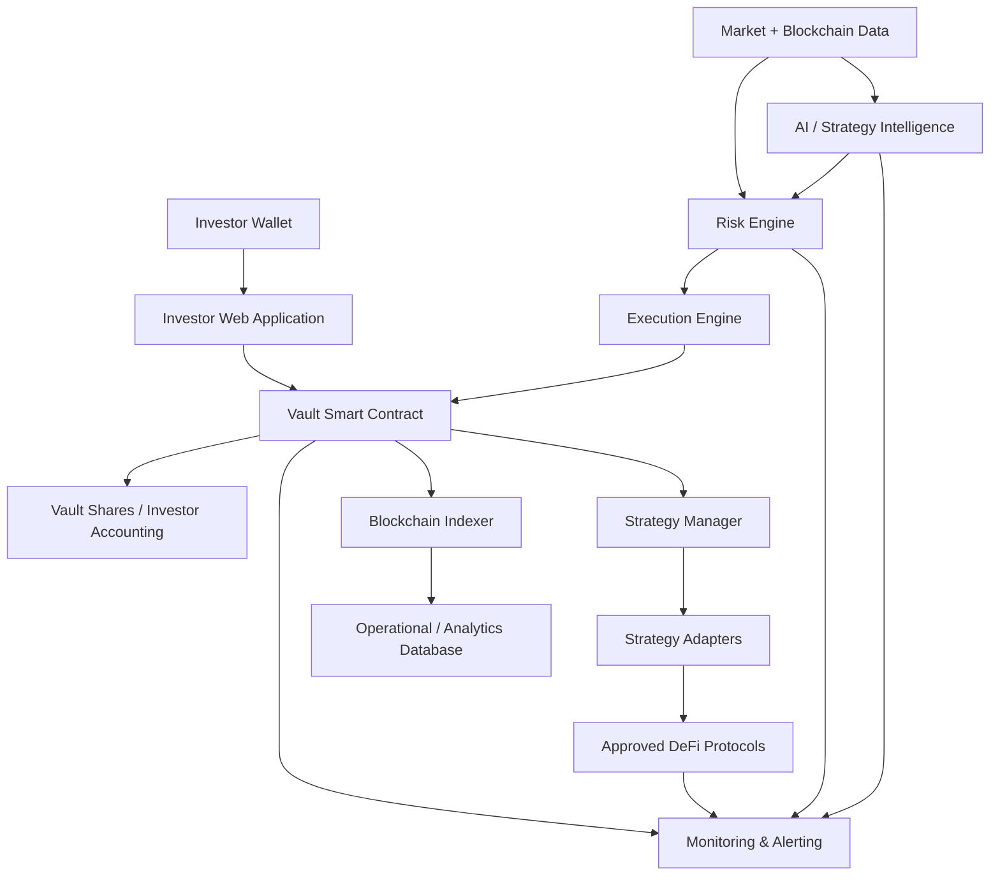
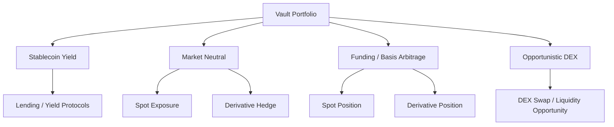
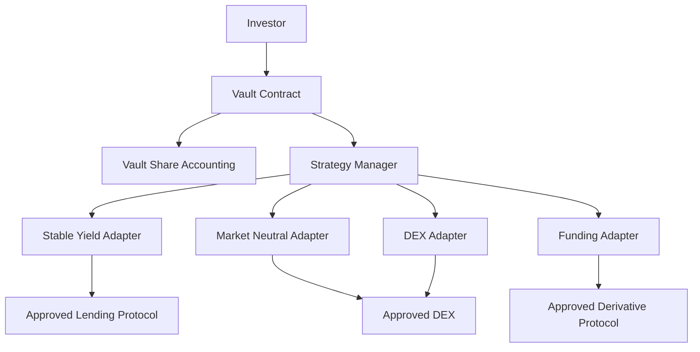
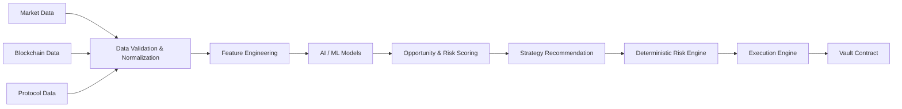
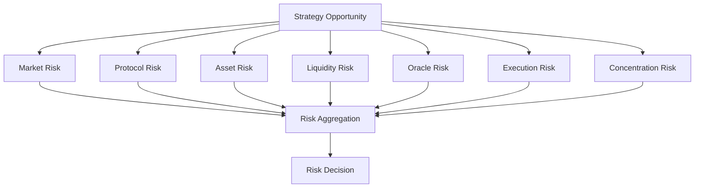
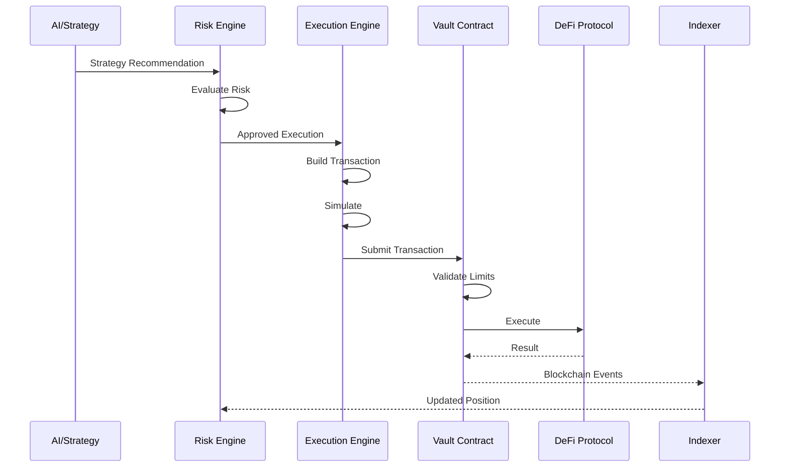
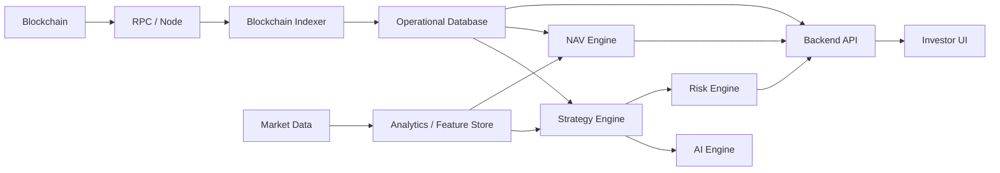
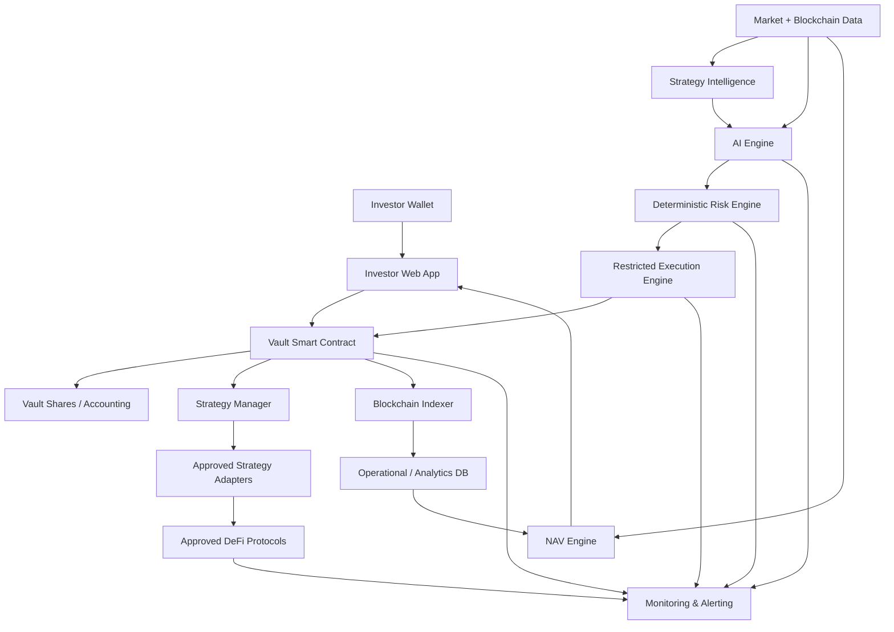

# AI-Driven DeFi Multi-Strategy Vault

# Technical Architecture & System Design Document

**Document Status:** Proposed  
**Version:** 1.0  
**Purpose:** Technical architecture, system design, security model, strategy framework, AI integration, risk controls, implementation approach, and clarification requirements

---

## 1. Executive Summary

The proposed system is a **non-custodial, AI-assisted DeFi multi-strategy vault** designed to allocate investor capital across multiple yield and market-opportunity strategies while prioritizing capital preservation.

The platform will allow investors to:

- Deposit supported digital assets into a smart-contract-controlled vault.
- Receive vault shares representing their proportional ownership.
- View current NAV and share value.
- Monitor strategy allocations and protocol exposure.
- Configure an approved risk profile.
- View historical performance and transaction records.
- Withdraw assets according to the vault's withdrawal and settlement rules.

The system will support multiple strategy categories, including:

1. Stablecoin yield
2. Market-neutral strategies
3. Funding/basis arbitrage
4. Opportunistic DEX strategies

AI and quantitative models will be used to identify opportunities, estimate expected returns, evaluate market conditions, and recommend portfolio allocations.

However, **AI should not have unrestricted authority over investor funds**.

The recommended control hierarchy is:

```text
Market / Blockchain Data
        |
        v
Strategy Intelligence / AI
        |
        v
Deterministic Risk Engine
        |
        v
Execution Engine
        |
        v
Smart Contract Risk Controls
        |
        v
Approved DeFi Protocol
````

This creates a layered security model where:

* AI can recommend.
* Risk systems can approve or reject.
* Execution systems can submit transactions.
* Smart contracts enforce hard limits.
* DeFi protocols execute financial operations.

The core principle is:

> **A compromise or failure of the AI model, backend, market-data provider, or executor must not automatically result in unrestricted access to investor capital.**

---

# 2. Client Requirement Summary

The client requires a scalable DeFi system capable of automatically allocating capital across multiple strategies.

The platform should provide:

### Investor Features

* Wallet-based onboarding.
* Deposit and withdrawal.
* Vault share ownership.
* Transparent NAV.
* Strategy allocation visibility.
* Performance reporting.
* Risk profile configuration.
* Transaction history.
* Investor-level accounting.
* Performance attribution.

### Strategy Features

* Multiple independent strategies.
* Strategy-specific allocation limits.
* Strategy-level risk evaluation.
* Protocol-level exposure limits.
* Automated rebalancing.
* Emergency exits.
* Strategy enable/disable controls.

### AI Features

* Market opportunity detection.
* Strategy scoring.
* Expected-return estimation.
* Risk-adjusted opportunity ranking.
* Allocation recommendations.
* Dynamic rebalancing recommendations.
* Market-regime detection.

### Risk Features

* Hard-coded risk controls.
* Exposure limits.
* Drawdown limits.
* Liquidity requirements.
* Slippage controls.
* Protocol allowlists.
* Asset allowlists.
* Transaction limits.
* Emergency circuit breakers.

### Operational Features

* Real-time monitoring.
* Blockchain transaction monitoring.
* Position reconciliation.
* Alerting.
* Audit logs.
* Strategy performance analytics.
* Protocol health monitoring.

---

# 3. System Goals

## 3.1 Primary Goals

The system should:

1. Preserve investor capital through layered controls.
2. Maintain non-custodial asset ownership.
3. Support multiple DeFi strategies.
4. Enable controlled automation.
5. Provide transparent investor accounting.
6. Provide accurate NAV calculation.
7. Separate AI decision-making from fund custody.
8. Support protocol-level risk management.
9. Enable progressive strategy rollout.
10. Support future multi-chain expansion.

---

# 4. Core Architectural Principles

The architecture should follow the following principles.

## 4.1 Capital Preservation First

Capital preservation takes priority over maximizing returns.

A strategy should not be executed simply because it has a high expected return.

The system should consider:

```text
Expected Return
        +
Liquidity
        +
Protocol Risk
        +
Market Risk
        +
Execution Risk
        +
Oracle Risk
        +
Concentration Risk
        +
Operational Risk
```

---

## 4.2 AI Is Not the Custodian

AI must never directly control unrestricted access to investor funds.

AI should produce structured recommendations.

Example:

```json
{
  "strategy_id": "funding_arbitrage_01",
  "recommended_allocation": 0.15,
  "expected_return": 0.082,
  "risk_score": 0.31,
  "confidence": 0.87,
  "max_position_size": 100000,
  "valid_until": "timestamp",
  "reason_code": "POSITIVE_FUNDING"
}
```

The recommendation must then pass through deterministic risk controls.

---

## 4.3 Defense in Depth

No single component should be trusted as the only protection mechanism.

Protection should exist at multiple layers:

```text
AI Layer
   |
Risk Engine
   |
Execution Engine
   |
Smart Contract
   |
Protocol
```

---

## 4.4 Least Privilege

Every component should have the minimum permissions required.

For example:

* Investor wallet: investor actions only.
* Backend: no unrestricted withdrawal authority.
* Executor: approved transactions only.
* Strategy adapter: approved protocols/assets only.
* Governance: configuration and upgrade authority according to governance rules.
* Emergency guardian: emergency controls only.

---

# 5. High-Level System Architecture



---

# 6. Major System Components

The system can be divided into the following logical layers.

| Layer                | Responsibility                                      |
| -------------------- | --------------------------------------------------- |
| Investor Application | Investor interaction and reporting                  |
| Wallet               | Investor transaction signing                        |
| Vault Contracts      | Asset custody, shares, accounting and hard controls |
| Strategy Manager     | Strategy registration and allocation                |
| Strategy Adapters    | Protocol-specific execution                         |
| DeFi Protocols       | Actual financial operations                         |
| Market Data          | Prices, funding, liquidity and market conditions    |
| AI Engine            | Opportunity and allocation recommendations          |
| Risk Engine          | Deterministic risk validation                       |
| Execution Engine     | Transaction construction and submission             |
| Indexer              | Blockchain event ingestion                          |
| NAV Engine           | Portfolio valuation                                 |
| Monitoring           | System and risk monitoring                          |
| Database             | Operational and analytical data                     |

---

# 7. Strategy vs Protocol vs Execution

These concepts should remain separate.

## 7.1 Protocol

A protocol is the underlying DeFi infrastructure that performs a financial operation.

Examples include:

* Lending protocols
* DEXs
* Liquidity protocols
* Perpetual protocols
* Derivatives protocols

---

## 7.2 Strategy

A strategy defines how capital is used to generate returns.

For example:

```text
Market-Neutral Strategy
    |
    +-- Long Spot
    |
    +-- Short Derivative
    |
    +-- Maintain Hedge Ratio
    |
    +-- Collect Funding / Basis
    |
    +-- Rebalance
```

A strategy may use multiple protocols.

---

## 7.3 Strategy Adapter

A strategy adapter provides a controlled interface between the vault and a specific protocol.

Example:

```text
Vault
 |
 +-- Aave Strategy Adapter
 |       |
 |       +-- Aave
 |
 +-- Uniswap Strategy Adapter
 |       |
 |       +-- Uniswap
 |
 +-- Perpetual Strategy Adapter
         |
         +-- Approved Perpetual Protocol
```

This prevents the core vault from containing protocol-specific logic.

---

# 8. Strategy Architecture

Each strategy should contain the following logical components:

```text
Strategy
 |
 +-- Objective
 |
 +-- Entry Conditions
 |
 +-- Exit Conditions
 |
 +-- Allocation Rules
 |
 +-- Risk Rules
 |
 +-- Protocol Integrations
 |
 +-- Position Management
 |
 +-- Valuation
 |
 +-- Rebalancing
 |
 +-- Monitoring
 |
 +-- Emergency Exit
```

A strategy therefore is not simply a Solidity contract.

It consists of:

1. Strategy intelligence.
2. Strategy execution.
3. Position management.
4. Risk evaluation.
5. Valuation.
6. Monitoring.
7. On-chain enforcement.

---

# 9. Proposed Strategy Framework

The initial architecture can support four major strategy categories.



The exact protocols and assets remain subject to client confirmation.

---

# 10. Stablecoin Yield Strategy

## 10.1 Objective

Generate relatively predictable yield from stablecoin-based DeFi opportunities while minimizing exposure to directional market movements.

Potential sources:

* Lending yield.
* Liquidity incentives.
* Stablecoin liquidity pools.
* Other approved low-volatility yield opportunities.

---

## 10.2 Opportunity Inputs

The strategy may evaluate:

* Current APY.
* Historical APY.
* Yield sustainability.
* Protocol TVL.
* Liquidity.
* Stablecoin quality.
* Stablecoin depeg probability.
* Protocol risk.
* Smart contract audit history.
* Oracle quality.
* Utilization.
* Withdrawal liquidity.
* Gas costs.
* Expected net return.

---

## 10.3 Risks

Potential risks include:

* Stablecoin depeg.
* Protocol exploit.
* Bad debt.
* Liquidity crisis.
* Oracle failure.
* Governance attack.
* Yield collapse.
* Stablecoin issuer risk.
* Smart contract upgrade risk.

---

## 10.4 Controls

Recommended controls:

* Approved stablecoin allowlist.
* Approved protocol allowlist.
* Maximum protocol exposure.
* Maximum asset exposure.
* Minimum liquidity requirement.
* Depeg detection.
* Maximum allocation.
* Emergency withdrawal mechanism.
* Protocol health monitoring.

---

# 11. Market-Neutral Strategy

## 11.1 Objective

Attempt to generate returns while reducing directional market exposure.

A conceptual implementation:

```text
Long Spot Asset
       +
Short Derivative
       =
Reduced Directional Exposure
```

For example:

```text
Buy ETH
   |
   +---- Long Spot

Short ETH Perpetual
   |
   +---- Hedge
```

The strategy attempts to capture:

* Funding.
* Basis.
* Relative pricing inefficiencies.
* Other market-neutral opportunities.

---

## 11.2 Risks

Market-neutral does not mean risk-free.

Risks include:

* Basis divergence.
* Funding reversal.
* Liquidation.
* Oracle failure.
* Slippage.
* Leg mismatch.
* Execution delay.
* Derivative protocol failure.
* Liquidity risk.
* Counterparty risk.
* Margin requirements.

---

# 12. Funding / Basis Arbitrage

## 12.1 Objective

Capture a positive spread between related spot and derivative instruments.

Potential inputs:

* Spot price.
* Derivative price.
* Funding rate.
* Historical funding.
* Basis.
* Funding volatility.
* Trading fees.
* Gas.
* Slippage.
* Margin requirements.
* Liquidation distance.
* Available liquidity.

---

## 12.2 Example

Conceptually:

```text
Acquire Spot Asset
        |
        +------ Long Spot

Open Offset Position
        |
        +------ Short Derivative

Collect Funding / Capture Basis
        |
        v
Rebalance / Exit
```

The actual implementation depends heavily on the selected derivative venue.

---

# 13. Opportunistic DEX Strategy

This strategy is expected to be the most dynamic.

The system may identify opportunities such as:

* Price discrepancies.
* Short-lived pricing inefficiencies.
* Cross-pool opportunities.
* Liquidity opportunities.
* Relative-value opportunities.

The decision should be based on **net expected return**, not gross price difference.

```text
Gross Opportunity
      |
      - Trading Fees
      |
      - Gas
      |
      - Slippage
      |
      - Expected MEV Cost
      |
      - Execution Risk
      |
      v
Net Opportunity
      |
      v
Risk Engine
      |
      v
Execution
```

---

# 14. Strategy Adapter Architecture

A common interface should isolate strategy logic from protocol implementation.

Conceptually:

```python
class StrategyAdapter:

    def deposit(self, asset, amount):
        pass

    def withdraw(self, asset, amount):
        pass

    def rebalance(self, parameters):
        pass

    def current_value(self):
        pass

    def risk_metrics(self):
        pass

    def emergency_exit(self):
        pass
```

The final interface will depend on the actual protocol architecture.

---

# 15. Smart Contract Architecture

The recommended smart-contract structure is:



---

# 16. Vault Contract Responsibilities

The vault should be responsible for:

* Investor deposits.
* Investor withdrawals.
* Share issuance.
* Share redemption.
* Asset custody.
* Strategy allocation limits.
* Protocol allowlists.
* Asset allowlists.
* Executor authorization.
* Emergency controls.
* Pause functionality.
* Configuration enforcement.
* Interaction with approved strategy adapters.

The vault should not contain complex AI or market-analysis logic.

---

# 17. Strategy Manager

A Strategy Manager can act as the portfolio-level coordination layer.

Responsibilities:

* Register strategies.
* Enable/disable strategies.
* Maintain strategy allocation limits.
* Maintain protocol exposure limits.
* Track strategy exposure.
* Authorize approved strategy adapters.
* Enforce portfolio-level allocation constraints.

Conceptually:

```text
Vault
  |
  v
Strategy Manager
  |
  +-- Stable Yield
  |
  +-- Market Neutral
  |
  +-- Funding Arbitrage
  |
  +-- DEX Opportunities
```

---

# 18. Hard Risk Controls

Risk controls should exist on-chain wherever practical.

Potential controls include:

| Control                     | Example            |
| --------------------------- | ------------------ |
| Maximum strategy allocation | 30%                |
| Maximum protocol exposure   | 25%                |
| Maximum asset exposure      | 30%                |
| Maximum chain exposure      | 50%                |
| Maximum transaction size    | Defined limit      |
| Maximum slippage            | Defined limit      |
| Minimum expected return     | Defined threshold  |
| Maximum leverage            | Defined limit      |
| Maximum drawdown            | Defined limit      |
| Minimum idle liquidity      | Defined percentage |
| Transaction deadline        | Short expiry       |
| Approved assets             | Allowlist          |
| Approved protocols          | Allowlist          |
| Approved functions          | Allowlist          |

The actual numerical values must be agreed with the client.

---

# 19. External Contract Call Security

A generic unrestricted function such as:

```solidity
execute(address target, bytes calldata data)
```

creates significant risk if the executor can call arbitrary contracts.

A safer architecture is:

```text
Executor Request
      |
      v
Target Allowlist
      |
      v
Function Selector Allowlist
      |
      v
Asset Allowlist
      |
      v
Amount Limit
      |
      v
Slippage Limit
      |
      v
Strategy Exposure Limit
      |
      v
Deadline
      |
      v
Execute
```

The vault should never blindly trust arbitrary transaction calldata.

---

# 20. AI Architecture

AI should be implemented as an intelligence layer rather than a custody layer.



---

# 21. Potential AI Responsibilities

AI may be used for:

### Opportunity Detection

Identify unusual or attractive market conditions.

### Market Regime Detection

Examples:

* High volatility.
* Low volatility.
* Trending market.
* Mean-reverting market.
* Liquidity stress.
* Funding imbalance.

### Strategy Ranking

Rank available opportunities based on:

* Expected return.
* Risk.
* Liquidity.
* Correlation.
* Protocol quality.
* Execution cost.

### Allocation Recommendation

Recommend:

```text
Stable Yield        35%
Market Neutral      30%
Funding Arbitrage   20%
DEX Opportunities   15%
```

These percentages are illustrative only.

---

# 22. AI Output Contract

AI outputs should be structured and versioned.

Example:

```json
{
  "strategy_id": "strategy_001",
  "model_version": "model_2026_01",
  "recommended_allocation": 0.20,
  "expected_return": 0.075,
  "risk_score": 0.28,
  "confidence": 0.84,
  "max_position_size": 50000,
  "valid_until": 1750000000,
  "reason_code": "FAVORABLE_FUNDING",
  "feature_timestamp": 1750000000
}
```

The backend should validate:

* Data types.
* Ranges.
* Required fields.
* Model version.
* Timestamp.
* Allocation limits.
* Confidence limits.

---

# 23. AI Must Not Override Risk Controls

If AI recommends:

```text
Allocation = 70%
```

but the vault has:

```text
Maximum strategy allocation = 30%
```

the risk engine must reject or reduce the recommendation.

Therefore:

```text
AI Recommendation
        |
        v
Risk Constraints
        |
        +---- Reject
        |
        +---- Reduce
        |
        +---- Approve
```

AI cannot override hard-coded safety limits.

---

# 24. AI Failure Handling

Potential failures:

* AI service unavailable.
* Model timeout.
* Incorrect prediction.
* Stale model.
* Market-data poisoning.
* Model drift.
* Bad training data.
* Incorrect confidence.
* External AI API failure.
* Model infrastructure compromise.

Recommended behavior:

```text
AI unavailable
      |
      v
Stop new AI-driven allocation
      |
      +-- Existing positions remain monitored
      |
      +-- Risk engine continues
      |
      +-- Emergency controls remain available
```

A predefined deterministic fallback may be implemented for selected low-risk operations.

---

# 25. AI Security Risks

Important AI-specific threats include:

### Data Poisoning

Manipulated market or protocol data can influence decisions.

### Model Drift

Market behavior changes over time.

### Overfitting

Historical performance may not generalize to future markets.

### Adversarial Inputs

Attackers may intentionally create market conditions designed to influence strategy models.

### Incorrect Confidence

A model can produce high confidence despite poor predictions.

### Model/API Compromise

An attacker compromising the model-serving infrastructure could influence recommendations.

### Hidden Correlations

Multiple strategies may appear diversified but actually depend on the same underlying risk.

Therefore, AI output must always pass through deterministic controls.

---

# 26. Risk Engine

The Risk Engine is one of the most important components of the platform.

It should evaluate:

### Portfolio Risk

* Total exposure.
* Concentration.
* Drawdown.
* Correlation.
* Liquidity.

### Strategy Risk

* Strategy volatility.
* Historical drawdown.
* Current exposure.
* Expected return.

### Protocol Risk

* Smart-contract maturity.
* Audit history.
* TVL.
* Governance.
* Upgradeability.
* Incident history.
* Oracle dependencies.

### Asset Risk

* Volatility.
* Liquidity.
* Depeg probability.
* Concentration.

### Execution Risk

* Slippage.
* Gas.
* MEV.
* Liquidity.
* Transaction failure probability.

### Operational Risk

* RPC availability.
* Oracle availability.
* AI availability.
* Indexing status.

---

# 27. Risk Evaluation Pipeline



---

# 28. Risk Decisions

The Risk Engine may return:

```text
APPROVE
APPROVE_WITH_REDUCED_ALLOCATION
DEFER
REBALANCE
EXIT
EMERGENCY_EXIT
REJECT
```

The decision should be deterministic and auditable.

---

# 29. Portfolio-Level Allocation

Allocation should not only consider individual strategy risk.

Example:

```text
Strategy A -> Protocol X = 30%
Strategy B -> Protocol X = 20%
Strategy C -> Protocol X = 15%
```

Although individual strategies may be within their limits, total protocol exposure is:

```text
30 + 20 + 15 = 65%
```

If:

```text
Maximum Protocol Exposure = 50%
```

the system must reject further exposure and potentially rebalance existing positions.

This is critical because diversification across strategies does not necessarily mean diversification across underlying risks.

---

# 30. Diversification Model

Diversification should consider:

* Strategy.
* Protocol.
* Asset.
* Chain.
* Counterparty.
* Market factor.
* Liquidity source.

For example:

```text
Strategy Diversification
        |
        v
Protocol Diversification
        |
        v
Asset Diversification
        |
        v
Chain Diversification
        |
        v
Risk-Factor Diversification
```

---

# 31. Non-Custodial Architecture

The strongest non-custodial architecture is:

```text
Investor Wallet
       |
       v
Vault Smart Contract
       |
       v
Approved DeFi Protocol
```

The backend does not own investor funds.

---

# 32. Non-Custodial Approach Options

## Approach A: Pure On-Chain DeFi

```text
Investor
   |
Vault
   |
DeFi Protocol
```

Advantages:

* Strongest non-custodial model.
* Transparent.
* On-chain execution.
* No centralized fund custody.

Challenges:

* Limited protocol availability.
* Complex strategy implementation.
* Gas costs.
* On-chain execution constraints.

---

## Approach B: Restricted Automated Executor

```text
AI
 |
Risk Engine
 |
Executor
 |
Vault
 |
DeFi
```

The executor submits approved transactions but cannot arbitrarily withdraw funds.

The smart contract enforces:

* Allowed protocols.
* Allowed functions.
* Allowed assets.
* Position limits.
* Allocation limits.
* Transaction limits.

This is the recommended approach for controlled automation.

---

## Approach C: Centralized Exchange Integration

Example:

```text
Vault
 |
CEX Account
 |
Exchange
```

This introduces substantially different risks:

* Exchange custody.
* Counterparty risk.
* API key security.
* Withdrawal permissions.
* Exchange insolvency.
* Regulatory implications.
* Operational dependency.

Whether this is permitted must be explicitly confirmed.

---

# 33. Recommended Non-Custodial Approach

The recommended initial architecture is:

```text
Investor
    |
    v
Vault Smart Contract
    |
    +-- Strategy Manager
            |
            +-- Approved Adapter
                    |
                    +-- Approved DeFi Protocol
```

Off-chain components should provide intelligence and execution orchestration without receiving unrestricted custody.

---

# 34. NAV Architecture

NAV is central to investor accounting.

Conceptually:

```text
NAV =
Total Asset Value
+ Accrued / Unrealized Value
- Liabilities
- Fees
```

Share price:

```text
Share Price = NAV / Total Outstanding Shares
```

The exact accounting methodology must be finalized.

---

# 35. NAV Data Sources

NAV may need to account for:

* Vault balances.
* Lending positions.
* LP positions.
* Derivative positions.
* Rewards.
* Accrued yield.
* Debt.
* Fees.
* Unsettled transactions.
* Oracle prices.
* Strategy-specific valuations.

A simple wallet balance is not sufficient for complex strategies.

---

# 36. Oracle Architecture

A proposed valuation pipeline:

```text
Primary Price Source
       |
       v
Freshness Check
       |
       v
Deviation Check
       |
       v
Fallback Source
       |
       v
Circuit Breaker
       |
       v
NAV Engine
```

If an oracle becomes stale or deviates beyond acceptable thresholds, the system should not blindly use the value.

---

# 37. Oracle Risks

Potential issues:

* Stale prices.
* Manipulated prices.
* Low-liquidity assets.
* Flash-loan manipulation.
* Oracle outage.
* Incorrect decimals.
* Chain-specific feed failures.
* Price divergence between venues.

Oracle failures should be able to trigger strategy restrictions or emergency controls.

---

# 38. Investor Accounting

The vault should maintain transparent ownership accounting.

Example:

```text
Investor A -> 10% shares
Investor B -> 20% shares
Investor C -> 70% shares
```

If the portfolio value changes, ownership percentage remains based on share ownership unless additional deposits/withdrawals occur.

Important accounting rules include:

* Share issuance.
* Share redemption.
* NAV pricing.
* Rounding.
* Fees.
* Pending withdrawals.
* Deposit settlement.
* Minimum deposit.
* Minimum withdrawal.
* Withdrawal queues if required.
* Strategy liquidity constraints.

---

# 39. Performance Attribution

Performance should be attributable to individual strategies.

Example:

```text
Total Portfolio Return

    + Stable Yield Contribution
    + Market Neutral Contribution
    + Funding/Basis Contribution
    + DEX Contribution
    - Gas Costs
    - Trading Fees
    - Protocol Fees
    - Management Fees
    - Performance Fees
```

This improves transparency and enables strategy-level evaluation.

---

# 40. Configurable Risk Profiles

The system may support profiles such as:

```text
Conservative
Balanced
Aggressive
```

Each profile may define:

* Maximum volatility.
* Maximum strategy exposure.
* Maximum protocol exposure.
* Maximum drawdown.
* Maximum opportunistic allocation.
* Liquidity reserve.

However:

> An investor risk profile must never override global protocol-level safety limits.

---

# 41. Monitoring Architecture

Monitoring should cover:

```text
Vault
 |
 +-- Assets
 |
 +-- Shares
 |
 +-- NAV
 |
 +-- Strategies
 |
 +-- Protocols
 |
 +-- Transactions
 |
 +-- Risk
 |
 +-- AI
 |
 +-- Blockchain
```

---

# 42. Emergency Controls

Recommended controls include:

* Pause deposits.
* Pause withdrawals where legally and technically necessary.
* Pause a strategy.
* Disable a protocol.
* Disable an asset.
* Disable an executor.
* Stop automated allocation.
* Emergency strategy exit.
* Move assets to approved safe assets.
* Disable new positions.

Emergency actions should be subject to strict role permissions.

---

# 43. Emergency Scenario

Example:

```text
Protocol vulnerability detected
        |
        v
Monitoring Alert
        |
        v
Risk Engine raises critical risk
        |
        v
Protocol disabled
        |
        v
New allocations blocked
        |
        v
Existing positions evaluated
        |
        v
Emergency Exit if required
```

---

# 44. DeFi Protocol Risk

Third-party protocols introduce substantial risk.

Before integration, each protocol should be evaluated for:

* Smart-contract audit history.
* Code maturity.
* TVL.
* Historical incidents.
* Governance structure.
* Upgradeability.
* Admin privileges.
* Oracle architecture.
* Liquidity.
* Emergency controls.
* Bug bounty.
* Dependency chain.

An audit does not guarantee protocol safety.

---

# 45. Third-Party Dependencies

The system may depend on:

* Blockchain RPC providers.
* Blockchain nodes.
* Market data providers.
* Oracle providers.
* DeFi protocols.
* DEX infrastructure.
* Derivative protocols.
* AI/ML infrastructure.
* Cloud infrastructure.
* Database systems.
* Monitoring platforms.
* Indexing services.
* Multisig/key-management systems.

Every critical dependency should have a defined failure mode.

Where practical:

```text
Primary Provider
       |
       v
Health Check
       |
       +---- Healthy --> Continue
       |
       +---- Failed --> Fallback
```

---

# 46. Third-Party Integration Challenges

Potential challenges include:

### Protocol Changes

A protocol may upgrade its contracts or interfaces.

### Chain-Specific Deployment

The same protocol may have different addresses and capabilities across chains.

### Liquidity Changes

An opportunity that exists today may disappear quickly.

### API Dependency

Off-chain data providers may change APIs or become unavailable.

### Rate Limits

External APIs may restrict request frequency.

### Oracle Differences

Different providers may produce different prices.

### Protocol Governance

A protocol's governance may change parameters or upgrade contracts.

The system should therefore maintain explicit protocol versions and configuration.

---

# 47. MEV Risk

DEX strategies may face:

* Front-running.
* Sandwich attacks.
* Back-running.
* Transaction reordering.
* Arbitrage competition.

Mitigations may include:

* Maximum slippage.
* Transaction deadlines.
* Minimum profitable output.
* Transaction simulation.
* Route validation.
* Gas limits.
* Private transaction mechanisms where appropriate.
* Minimum expected net profit.

---

# 48. Transaction Simulation

Before executing a high-value transaction:

```text
Strategy Decision
       |
       v
Build Transaction
       |
       v
Simulate
       |
       +-- Unexpected Result --> Reject
       |
       +-- Expected Result --> Risk Check
                              |
                              v
                           Submit
```

Simulation should evaluate:

* Expected output.
* Gas.
* Slippage.
* Token balances.
* Position changes.
* Revert behavior.

---

# 49. Position Reconciliation

The system should continuously compare:

```text
Expected Position
        vs
Actual Blockchain Position
```

Differences can occur due to:

* Fees.
* Slippage.
* Partial execution.
* Protocol behavior.
* Rewards.
* Liquidations.
* Indexing delays.

Material discrepancies should generate alerts.

---

# 50. Transaction Lifecycle



---

# 51. Multi-Chain Architecture

The system should be designed to support future multi-chain deployment.

Recommended approach:

```text
                    Core Platform
                         |
          +--------------+--------------+
          |              |              |
       Chain A        Chain B        Chain C
          |              |              |
       Vault A        Vault B        Vault C
          |              |              |
      Adapters        Adapters        Adapters
```

The core platform can share:

* Investor application.
* Backend services.
* Strategy intelligence.
* Risk engine.
* Monitoring.
* Reporting.

Chain-specific components should remain isolated.

---

# 52. Multi-Chain Risks

Multi-chain architecture introduces:

* Bridge risk.
* Message-passing risk.
* Different finality assumptions.
* Different gas models.
* Different liquidity.
* Replay risk.
* Chain outages.
* Cross-chain accounting complexity.
* Oracle differences.
* Protocol availability differences.

For this reason, a **single-chain initial deployment is recommended unless multi-chain support is an explicit MVP requirement**.

---

# 53. Backend Architecture

A modular backend may be structured approximately as:

```text
backend/
|
+-- api/
|
+-- auth/
|
+-- investors/
|
+-- vaults/
|
+-- strategies/
|   |
|   +-- base/
|   +-- stable_yield/
|   +-- market_neutral/
|   +-- funding_arbitrage/
|   +-- dex_opportunistic/
|
+-- ai/
|
+-- risk/
|
+-- execution/
|
+-- protocols/
|   |
|   +-- lending/
|   +-- dex/
|   +-- derivatives/
|
+-- portfolio/
|
+-- nav/
|
+-- monitoring/
|
+-- blockchain/
|
+-- data/
|
+-- workers/
|
+-- configuration/
|
+-- tests/
```

The actual technology stack should be finalized after requirements and chain selection.

---

# 54. API Architecture

Potential API groups:

```text
/api/auth
/api/investors
/api/vaults
/api/strategies
/api/allocations
/api/positions
/api/nav
/api/performance
/api/transactions
/api/risk
/api/monitoring
```

Example endpoints:

```text
GET  /api/vaults
GET  /api/vaults/{id}
GET  /api/vaults/{id}/nav
GET  /api/vaults/{id}/strategies
GET  /api/vaults/{id}/positions
GET  /api/vaults/{id}/performance
GET  /api/vaults/{id}/transactions
GET  /api/vaults/{id}/risk
```

Investor transactions should ultimately be signed by the investor's wallet where applicable.

---

# 55. Frontend Architecture

The investor application should provide:

### Wallet

* Connect wallet.
* View wallet balance.
* Sign transactions.

### Vault

* Deposit.
* Withdraw.
* Share balance.
* NAV.
* Share price.

### Strategies

* Current allocations.
* Strategy performance.
* Strategy status.
* Protocol exposure.

### Risk

* Investor risk profile.
* Portfolio risk.
* Drawdown.
* Concentration.

### Transparency

* Transaction history.
* On-chain transaction links.
* Strategy performance.
* Fees.
* Protocol exposure.

---

# 56. Data Architecture



---

# 57. Data Consistency

Blockchain should remain the authoritative source for:

* Asset balances.
* Share ownership.
* Transactions.
* Contract state.

The backend database should be treated as:

* Indexed representation.
* Analytics layer.
* Reporting layer.
* Operational metadata.

The backend database must not be treated as the ultimate source of truth for on-chain ownership.

---

# 58. Security Architecture

Security should be implemented across several layers.

## Smart Contract Security

* Access control.
* Reentrancy protection.
* Safe token handling.
* Oracle validation.
* External-call restrictions.
* Upgrade controls.
* Emergency pause.
* Strategy limits.

## Backend Security

* Authentication.
* Authorization.
* Secret management.
* API protection.
* Audit logging.
* Network security.
* Input validation.

## AI Security

* Input validation.
* Model versioning.
* Output validation.
* Confidence limits.
* Data integrity.
* Model monitoring.

## Infrastructure Security

* Key management.
* Least privilege.
* Network segmentation.
* Monitoring.
* Backups.
* Disaster recovery.

---

# 59. Key Management

Different keys should have different responsibilities.

Potential categories:

```text
Governance Key
Executor Key
Emergency Guardian
Deployment Key
Infrastructure Keys
```

High-value governance operations should preferably use:

```text
Multisig
   +
Timelock
```

rather than a single private key.

---

# 60. Executor Security

The executor should not have unrestricted custody.

If an executor key is compromised, the attacker should still be constrained by:

* Strategy limits.
* Protocol allowlists.
* Asset allowlists.
* Function allowlists.
* Transaction limits.
* Slippage limits.
* Position limits.
* On-chain validation.

This is a critical security invariant.

---

# 61. Upgradeability

Three approaches can be considered.

## Immutable Contracts

Advantages:

* Strong predictability.
* Reduced governance risk.

Disadvantages:

* Difficult to fix bugs.
* Difficult to integrate new protocols.

## Upgradeable Contracts

Advantages:

* Flexible.
* Easier to evolve.

Disadvantages:

* Upgrade key becomes highly sensitive.
* Governance risk.

## Hybrid

Recommended consideration:

* Core accounting and custody mechanisms minimized and heavily protected.
* Strategy adapters independently upgradeable or replaceable.
* Governance controlled by multisig/timelock.

---

# 62. Recommended Upgrade Process

```text
Proposed Upgrade
       |
       v
Testing
       |
       v
Security Review
       |
       v
Governance Approval
       |
       v
Multisig
       |
       v
Timelock
       |
       v
Upgrade
```

---

# 63. Smart Contract Testing

Required testing should include:

### Unit Testing

Individual functions and contracts.

### Integration Testing

Vault + strategy adapter + protocol.

### Fork Testing

Testing against realistic blockchain state.

### Fuzz Testing

Randomized inputs.

### Invariant Testing

Testing properties that must always remain true.

### Stress Testing

Large transactions, extreme markets and failure scenarios.

---

# 64. Example Security Invariants

The system should enforce invariants such as:

```text
Unauthorized account cannot withdraw investor funds.

Executor cannot exceed allocation limits.

Executor cannot call an unapproved protocol.

Executor cannot use an unapproved token.

Executor cannot exceed transaction limits.

Paused strategy cannot open new positions.

Portfolio allocation cannot exceed configured limits.

Investor share accounting remains consistent.

Emergency controls cannot be bypassed by standard executor roles.
```

---

# 65. Strategy Backtesting

Before automated deployment, strategies should be backtested.

Backtests should account for:

* Trading fees.
* Gas.
* Slippage.
* Liquidity.
* Funding costs.
* Position limits.
* Execution delay.
* Failed transactions.
* Rebalancing frequency.
* Drawdowns.
* Market regime changes.

Historical performance must not be treated as a guarantee of future results.

---

# 66. Stress Testing

The system should simulate scenarios including:

```text
10% market move
20% market move
Stablecoin depeg
Liquidity reduction
Gas spike
Oracle outage
Protocol pause
DEX liquidity collapse
Funding-rate reversal
Execution delay
RPC outage
AI outage
Market-data outage
Extreme volatility
```

The objective is to determine:

* Expected losses.
* Position behavior.
* Liquidation risk.
* Recovery behavior.
* Emergency exit behavior.

---

# 67. Failure Mode Handling

| Failure                      | Expected Response                               |
| ---------------------------- | ----------------------------------------------- |
| AI unavailable               | Stop new AI allocation or use approved fallback |
| Stale market data            | Reject affected strategy                        |
| Oracle unavailable           | Trigger circuit breaker                         |
| Protocol disabled            | Reject new allocations                          |
| Executor compromised         | On-chain limits restrict damage                 |
| RPC unavailable              | Fail over or stop execution                     |
| Transaction failure          | Mark failed and reconcile                       |
| Low liquidity                | Reduce or stop allocation                       |
| Drawdown exceeded            | Reduce or exit                                  |
| Chain outage                 | Stop affected chain                             |
| Unexpected protocol behavior | Disable protocol and alert                      |

---

# 68. Monitoring and Alerting

Critical alerts should include:

### Capital

* NAV drop.
* Unexpected asset movement.
* Large withdrawals.
* Large exposure changes.

### Risk

* Drawdown threshold.
* Concentration threshold.
* Protocol risk increase.
* Liquidity deterioration.

### Strategy

* Strategy failure.
* Unexpected P&L.
* Position mismatch.
* Rebalance failure.

### Blockchain

* Transaction failure.
* Gas spike.
* RPC failure.
* Chain congestion.

### Security

* Unauthorized access attempt.
* Unexpected contract interaction.
* Executor anomaly.
* Governance change.

---

# 69. Auditability

The platform should retain an audit trail for:

* Strategy decisions.
* AI recommendations.
* AI model versions.
* Risk decisions.
* Execution requests.
* Blockchain transactions.
* Position changes.
* Configuration changes.
* Protocol enable/disable actions.
* Risk-limit changes.
* Governance actions.

For an AI-generated recommendation, the system should ideally preserve:

```text
Model Version
+
Input Snapshot
+
Recommendation
+
Risk Evaluation
+
Final Decision
+
Transaction
+
Outcome
```

This provides an end-to-end decision trail.

---

# 70. Regulatory and Operational Considerations

The regulatory architecture depends heavily on:

* Operating jurisdiction.
* Investor jurisdictions.
* Entity structure.
* Whether the platform is considered an investment manager.
* Custody model.
* Supported assets.
* Use of derivatives.
* Use of centralized exchanges.
* Investor eligibility.
* KYC/AML requirements.
* Securities/token classification.
* Tax obligations.

Engineering requirements should be finalized after legal/compliance guidance.

Potential requirements may include:

* KYC.
* AML.
* Sanctions screening.
* Geographic restrictions.
* Investor eligibility.
* Transaction monitoring.
* Record retention.

The technical architecture should remain flexible enough to implement these requirements if required.

---

# 71. Major Architectural Challenges

## 71.1 Strategy Complexity

Each strategy may require different:

* Protocols.
* Data.
* Position models.
* Valuation.
* Risk controls.

A common strategy abstraction is therefore important.

---

## 71.2 NAV Complexity

Complex positions cannot always be valued using simple wallet balances.

Derivatives, LP positions, accrued rewards and debt must be incorporated.

---

## 71.3 Non-Custodial Automation

Automation must exist without creating unrestricted backend custody.

This is one of the most important architecture challenges.

---

## 71.4 AI Reliability

AI predictions can be wrong.

The architecture must therefore assume:

> AI can fail.

---

## 71.5 Protocol Risk

Every external protocol introduces additional attack surface.

---

## 71.6 Oracle Risk

Incorrect valuation can affect:

* NAV.
* Risk calculations.
* Liquidation decisions.
* Investor accounting.

---

## 71.7 MEV

High-frequency DEX opportunities can be difficult to execute profitably after MEV and transaction costs.

---

## 71.8 Multi-Chain Complexity

Supporting multiple chains significantly increases:

* Contract complexity.
* Monitoring.
* Liquidity fragmentation.
* Accounting complexity.
* Testing requirements.

---

# 72. Recommended Implementation Approaches

Three broad approaches can be considered.

## Approach A: Conservative Foundation

Start with:

* One blockchain.
* Core vault.
* Investor shares.
* NAV.
* Hard risk controls.
* One simple strategy.
* Monitoring.
* Emergency controls.

### Advantages

* Lower attack surface.
* Easier auditing.
* Easier testing.
* Faster validation.

### Recommendation

**Recommended starting approach.**

---

# 73. Approach B: Multi-Strategy Initial Release

Launch:

* Stable yield.
* Market neutral.
* Funding arbitrage.
* DEX strategies.
* AI allocation.

### Advantages

* More complete product.

### Disadvantages

* Significantly larger attack surface.
* More complex NAV.
* More complex testing.
* More protocol dependencies.
* More difficult audit.

This approach is not recommended for the first production deployment unless the client explicitly requires it.

---

# 74. Approach C: AI Recommendation First

Initially allow AI to:

```text
Analyze
  |
Rank
  |
Recommend
```

while actual execution remains restricted or manually approved.

After the recommendation system is validated:

```text
AI
 |
Risk
 |
Restricted Automation
```

This provides a safer path to progressively introduce AI-driven automation.

---

# 75. Recommended MVP

The recommended MVP should contain:

### Blockchain

* One selected blockchain.

### Vault

* Deposit.
* Withdrawal.
* Shares.
* NAV.
* Accounting.

### Risk

* Hard allocation limits.
* Protocol allowlist.
* Asset allowlist.
* Transaction limits.
* Slippage controls.
* Emergency pause.

### Strategy

* Strategy framework.
* Strategy Manager.
* One initial strategy.
* One or limited protocol integrations.

### Backend

* API.
* Blockchain indexing.
* NAV service.
* Risk engine.
* Monitoring.

### Frontend

* Wallet connection.
* Vault dashboard.
* Deposit/withdrawal.
* NAV.
* Shares.
* Performance.
* Transaction history.

### Security

* Unit tests.
* Integration tests.
* Fork tests.
* Fuzz/invariant tests.
* Internal security review.
* Independent audit before significant production capital.

---

# 76. Progressive Strategy Rollout

Recommended progression:

```text
Phase 1
Core Vault
    |
    v
Phase 2
Strategy Framework
    |
    v
Phase 3
Stable / Low Complexity Strategy
    |
    v
Phase 4
AI Recommendation
    |
    v
Phase 5
Controlled Automation
    |
    v
Phase 6
Market Neutral
    |
    v
Phase 7
Funding / Basis
    |
    v
Phase 8
Opportunistic DEX
    |
    v
Phase 9
Additional Chains
```

Each stage should only proceed after:

* Testing.
* Monitoring validation.
* Security review.
* Risk validation.
* Operational readiness.

---

# 77. Development Roadmap

## Phase 0: Requirements and Architecture

Deliverables:

* Final strategy definitions.
* Blockchain selection.
* Asset selection.
* Protocol selection.
* Custody model.
* Risk parameters.
* NAV methodology.
* Compliance requirements.

---

## Phase 1: Core Vault

Deliverables:

* Vault contracts.
* Share accounting.
* Deposit/withdrawal.
* Access control.
* Emergency controls.
* Initial risk controls.

---

## Phase 2: Strategy Framework

Deliverables:

* Strategy Manager.
* Strategy interface.
* Adapter architecture.
* Allocation management.
* Exposure tracking.

---

## Phase 3: First Strategy

Deliverables:

* Initial protocol adapter.
* Position management.
* Valuation.
* Strategy monitoring.
* Emergency exit.

---

## Phase 4: Intelligence Layer

Deliverables:

* Market data ingestion.
* Feature engineering.
* Strategy scoring.
* AI recommendation engine.
* Model versioning.
* Recommendation audit trail.

---

## Phase 5: Controlled Automation

Deliverables:

* Execution engine.
* Transaction simulation.
* Executor permissions.
* On-chain limits.
* Automated rebalancing.

---

## Phase 6: Additional Strategies

Deliverables:

* Market neutral.
* Funding/basis.
* DEX opportunities.

Each strategy requires independent risk evaluation and testing.

---

## Phase 7: Multi-Chain

Only after the single-chain architecture is stable:

* Additional vaults.
* Chain-specific adapters.
* Chain-specific risk.
* Cross-chain accounting if required.

---

# 78. Client Clarification Questions

The following information is required before finalizing the technical architecture.

---

## A. Blockchain

1. Which blockchain should be supported initially?
2. Is the first release single-chain or multi-chain?
3. If multi-chain, which chains are required?
4. Is cross-chain movement required?
5. If yes, which bridge or messaging protocol should be used?
6. Are EVM-compatible chains sufficient?
7. Are non-EVM chains required?

---

## B. Supported Assets

1. Which assets can investors deposit?
2. Which assets can strategies use?
3. Which stablecoins are approved?
4. Are native tokens supported?
5. Are wrapped assets supported?
6. Are there asset-specific exposure limits?

---

## C. Strategies

1. Which strategies are required for MVP?
2. Which strategies are future-phase strategies?
3. What is the exact definition of each strategy?
4. What are the entry conditions?
5. What are the exit conditions?
6. How often should strategies rebalance?
7. What constitutes a strategy failure?
8. What is the emergency exit condition?

---

## D. DeFi Protocols

1. Which protocols are preferred?
2. Should the engineering team select protocols?
3. Are there protocols that are mandatory?
4. Are audited protocols required?
5. What minimum protocol maturity is required?
6. Should protocols be dynamically disableable?
7. Are centralized exchanges allowed?
8. If yes, which exchanges?
9. Are derivatives protocols allowed?
10. Is the system strictly on-chain DeFi?

---

## E. Custody / Non-Custodial Model

1. Should all investor funds remain under vault smart-contract control?
2. Is an automated executor acceptable?
3. Can the backend operate an executor key?
4. What permissions should the executor have?
5. Should governance use a multisig?
6. Is a timelock required?
7. Who controls emergency actions?
8. Can emergency operators move assets?
9. If yes, to which destinations?
10. Is centralized exchange custody prohibited?

---

## F. AI

1. What does "AI dynamically allocates capital" mean operationally?
2. Should AI only recommend allocations?
3. Should AI be permitted to automatically execute allocations?
4. Which AI models are preferred?
5. Can external AI APIs be used?
6. Must models be self-hosted?
7. What market data sources should AI use?
8. What confidence threshold is required?
9. How will AI performance be evaluated?
10. How frequently should models be retrained?
11. Who approves model changes?
12. Can AI modify strategy parameters?
13. Which parameters must remain hard-coded?

---

## G. Risk Controls

1. What is the maximum allocation per strategy?
2. What is the maximum allocation per protocol?
3. What is the maximum allocation per asset?
4. What is the maximum allocation per chain?
5. Is leverage permitted?
6. What is the maximum leverage?
7. What is the maximum portfolio drawdown?
8. What is the maximum strategy drawdown?
9. What liquidity reserve must remain available?
10. What is the maximum slippage?
11. What is the minimum expected return?
12. What triggers an emergency exit?
13. Can investors choose risk profiles?
14. Are investor risk limits separate from global protocol limits?

---

## H. NAV and Accounting

1. How frequently should NAV be calculated?
2. Which oracle should be used?
3. What are the fallback price sources?
4. How should derivatives be valued?
5. How should LP positions be valued?
6. How should accrued rewards be valued?
7. How should debt be represented?
8. How should unrealized P&L be handled?
9. Are management fees required?
10. Are performance fees required?
11. How are fees calculated?
12. How are deposits priced?
13. How are withdrawals priced?
14. Is a withdrawal queue required?

---

## I. Investor Model

1. Is there one global vault or multiple vaults?
2. Are vault shares transferable?
3. What is the minimum investment?
4. What is the minimum withdrawal?
5. Are deposits immediately invested?
6. Are withdrawals immediate?
7. Are lockups required?
8. Are strategy allocations visible to investors?
9. Should individual protocol exposure be visible?
10. Can investors select strategies directly or only select risk profiles?

---

## J. Execution

1. How frequently should automated execution occur?
2. What triggers rebalancing?
3. Should execution be event-driven or scheduled?
4. What is the maximum acceptable execution latency?
5. Is transaction simulation mandatory?
6. What happens when a transaction fails?
7. How many retries are allowed?
8. What is the maximum gas cost?
9. What minimum net profit is required for arbitrage?
10. What slippage is acceptable?

---

## K. Security

1. Who controls governance?
2. Who can add a new protocol?
3. Who can add a new strategy?
4. Who can change risk limits?
5. Who can pause the system?
6. Who can perform emergency exits?
7. Are multisig wallets required?
8. Is a timelock required?
9. Which contracts must be upgradeable?
10. Which contracts should be immutable?
11. Is formal verification required?
12. Is an independent smart-contract audit mandatory before production?

---

## L. Monitoring

1. Which metrics must investors see?
2. Which metrics are admin-only?
3. Is real-time monitoring required?
4. Which alerts should be immediate?
5. Should investors receive notifications?
6. Should AI decisions be visible?
7. Should strategy decisions be publicly auditable?
8. How long should operational logs be retained?

---

## M. Compliance

1. What is the operating jurisdiction?
2. Which investor jurisdictions are supported?
3. Is KYC required?
4. Is AML screening required?
5. Are sanctions checks required?
6. Are geographic restrictions required?
7. Are there investor eligibility requirements?
8. Is legal analysis already available?
9. Are centralized exchanges permitted from a regulatory perspective?

---

# 79. Architecture-Blocking Decisions

The following decisions should be finalized before implementation begins:

```text
1. Initial blockchain
2. Supported assets
3. Initial strategies
4. Protocols per strategy
5. CEX usage
6. Custody model
7. Executor model
8. Governance model
9. AI role
10. Risk limits
11. NAV methodology
12. Oracle architecture
13. Fee model
14. Withdrawal model
15. Upgradeability model
16. Compliance requirements
```

---

# 80. Recommended Final Architecture

The proposed target architecture is:



---

# 81. End-to-End Decision Flow

The complete decision pipeline should be:

```text
1. Collect Market Data
          |
          v
2. Validate Data
          |
          v
3. Generate Strategy Features
          |
          v
4. AI / Quantitative Analysis
          |
          v
5. Identify Opportunity
          |
          v
6. Calculate Expected Return
          |
          v
7. Evaluate Risk
          |
          v
8. Check Portfolio Concentration
          |
          v
9. Check Protocol Exposure
          |
          v
10. Check Asset Exposure
          |
          v
11. Check Liquidity
          |
          v
12. Check Slippage / Gas / MEV
          |
          v
13. Generate Execution Plan
          |
          v
14. Simulate Transaction
          |
          v
15. Risk Validation
          |
          v
16. Submit Transaction
          |
          v
17. Smart Contract Validation
          |
          v
18. DeFi Protocol Execution
          |
          v
19. Index Blockchain Result
          |
          v
20. Reconcile Position
          |
          v
21. Update NAV
          |
          v
22. Update Performance
```

---

# 82. Core Security Principle

The most important architectural invariant is:

> **No single off-chain component should be capable of unrestricted movement of investor assets.**

Specifically:

```text
AI Compromise
     !=
Loss of Investor Funds

Backend Compromise
     !=
Unrestricted Fund Withdrawal

Market Data Manipulation
     !=
Unlimited Allocation

Executor Key Compromise
     !=
Unlimited Vault Access

Protocol Failure
     !=
Entire Portfolio Failure
```

The architecture should instead ensure that multiple independent controls must be satisfied before capital can be deployed.

---

# 83. Recommended Control Hierarchy

The final system should follow:

```text
                ┌─────────────────────┐
                │    Market Data      │
                └──────────┬──────────┘
                           |
                           v
                ┌─────────────────────┐
                │ Strategy / AI Layer │
                └──────────┬──────────┘
                           |
                           v
                ┌─────────────────────┐
                │    Risk Engine      │
                └──────────┬──────────┘
                           |
                           v
                ┌─────────────────────┐
                │ Execution Simulation│
                └──────────┬──────────┘
                           |
                           v
                ┌─────────────────────┐
                │ Execution Engine    │
                └──────────┬──────────┘
                           |
                           v
                ┌─────────────────────┐
                │ Vault Risk Controls │
                └──────────┬──────────┘
                           |
                           v
                ┌─────────────────────┐
                │ Approved Protocol   │
                └─────────────────────┘
```

This provides a clear separation between:

* Intelligence.
* Risk.
* Execution.
* Custody.
* Financial protocol execution.

---

# 84. Conclusion

The proposed architecture provides a foundation for a scalable, non-custodial, AI-assisted DeFi multi-strategy platform.

The key architectural decisions are:

1. Investor assets remain under smart-contract control.
2. AI is an intelligence and recommendation layer rather than a custodian.
3. Deterministic risk controls have authority over AI recommendations.
4. Smart contracts enforce critical capital-protection constraints.
5. Strategy logic is separated from protocol integrations.
6. Protocol-specific interactions are isolated through adapters.
7. NAV and investor accounting are treated as first-class system components.
8. Portfolio-level risk is evaluated in addition to individual strategy risk.
9. External protocol and oracle risks are explicitly monitored.
10. Automated execution is restricted and validated.
11. Multi-chain support should be introduced progressively.
12. Strategies should be introduced incrementally rather than launching all strategies simultaneously.
13. Security testing and independent audits should precede meaningful production capital deployment.

The recommended implementation philosophy is:

```text
Build the Vault
      |
      v
Secure the Vault
      |
      v
Add Strategy Framework
      |
      v
Add One Controlled Strategy
      |
      v
Validate NAV + Risk
      |
      v
Introduce AI Recommendations
      |
      v
Introduce Restricted Automation
      |
      v
Add Additional Strategies
      |
      v
Expand to Additional Chains
```

The final production architecture should only be locked after the client confirms the architecture-blocking decisions listed in Section 79.

```
```
