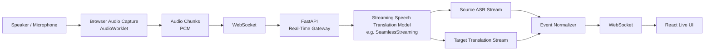
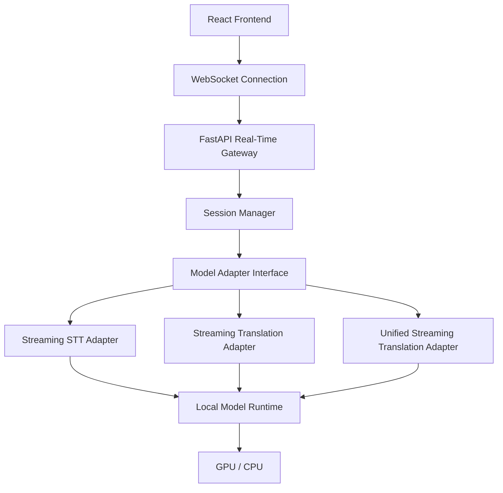
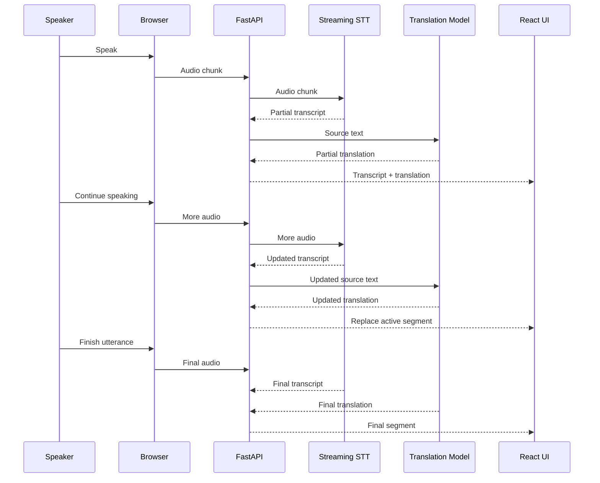
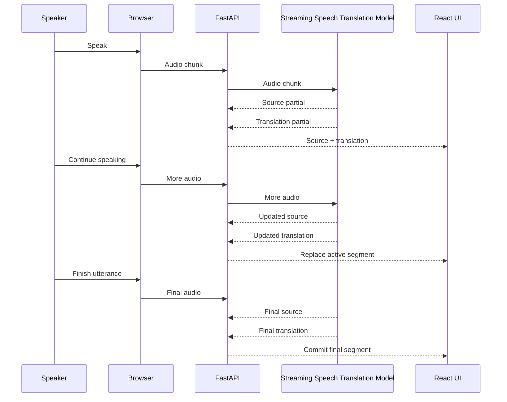
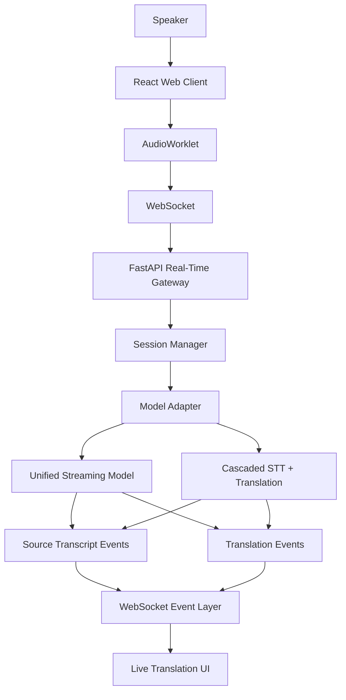

# Real-Time Audio Translation System

## Architecture Design Document

### 1. Objective

The system is designed to translate spoken audio in real time while continuously displaying:

1. The **source-language transcript**
2. The **translated text**
3. Both outputs while the speaker is still speaking

The system should **not wait for a complete sentence** before producing output.

For example, as the speaker says:

```text
I
I am
I am going
I am going to
I am going to the
I am going to the market
```

the UI should continuously update rather than waiting for:

> "I am going to the market."

The architecture considers two approaches:

* **Architecture A:** Streaming STT + Translation
* **Architecture B:** Unified streaming speech-translation model, such as Meta SeamlessStreaming

---

# 2. High-Level Requirements

### Functional requirements

* Capture microphone audio continuously.
* Send audio to the backend in small chunks.
* Process audio without waiting for the speaker to finish.
* Generate partial source-language transcription.
* Generate partial translated output.
* Update the UI continuously.
* Replace previous hypotheses when the model improves its prediction.
* Finalize text when the model determines that an utterance/segment is complete.
* Support multiple source and target languages.
* Maintain independent sessions for multiple users.

### Non-functional requirements

* Low end-to-end latency.
* No paid external AI/API dependency.
* Models should run on infrastructure controlled by the application.
* Model implementation should be replaceable.
* Audio should not be persisted unless explicitly required.
* The real-time path should be asynchronous.
* Architecture should support GPU inference.

---

# 3. Overall System Architecture

The common application architecture is:

```text
Browser
   │
   │ WebSocket
   ▼
FastAPI Real-Time Gateway
   │
   ▼
Model Adapter
   │
   ▼
Local Model Runtime
   │
   ├── Source Transcript
   │
   └── Translation
   │
   ▼
FastAPI
   │
   │ WebSocket events
   ▼
React UI
```

The major difference between the two architectures is **what happens inside the model layer**.

---

# 4. Architecture A: Cascaded Streaming STT + Translation

## 4.1 Concept

The first architecture separates speech recognition and translation.

```text
Audio
  ↓
Streaming STT
  ↓
Source Transcript
  ↓
Translation
  ↓
Translated Text
```

The STT model converts speech into text continuously.

The translation model then translates the evolving source transcript.

### Example

The speaker says:

> "I want to go to the market."

The system may receive:

```text
STT:
"I"
"I want"
"I want to go"
"I want to go to"
"I want to go to the market"
```

The translation stage may correspondingly produce:

```text
"I"
"मैं चाहता हूँ"
"मैं जाना चाहता हूँ"
"मैं जाना चाहता हूँ"
"मैं बाज़ार जाना चाहता हूँ"
```

The exact intermediate translations will depend on the languages and model.

---

# 5. Architecture A Diagram

```mermaid
flowchart LR

    A[Speaker / Microphone]

    B[Browser Audio Capture<br/>AudioWorklet]

    C[Audio Chunks<br/>PCM]

    D[WebSocket]

    E[FastAPI<br/>Real-Time Gateway]

    F[Streaming STT Model]

    G[Source Transcript<br/>Partial / Final]

    H[Translation Model]

    I[Translated Text<br/>Partial / Final]

    J[Event Normalizer]

    K[WebSocket]

    L[React Live UI]

    A --> B
    B --> C
    C --> D
    D --> E

    E --> F
    F --> G

    G --> H
    H --> I

    G --> J
    I --> J

    J --> K
    K --> L
```



---

# 6. Architecture A Components

## 6.1 Browser Audio Capture

The browser captures microphone audio using an appropriate Web Audio API mechanism, preferably `AudioWorklet` for continuous processing.

The browser should produce small audio chunks instead of recording a complete file.

Conceptually:

```text
Microphone
   ↓
AudioWorklet
   ↓
10s of audio
20s of audio
30s of audio
...
```

The actual chunk duration should be determined through benchmarking.

The browser sends the chunks through a WebSocket connection.

---

## 6.2 WebSocket

The WebSocket provides bidirectional communication.

Client → server:

```text
audio_chunk
audio_chunk
audio_chunk
audio_chunk
```

Server → client:

```text
transcript_partial
translation_partial
transcript_final
translation_final
```

This avoids repeatedly creating HTTP requests for every piece of audio.

---

# 7. FastAPI Real-Time Gateway

FastAPI maintains the real-time session.

A conceptual session could contain:

```text
session_id
source_language
target_language
model
connection
current_segment
```

The gateway is responsible for:

* Accepting WebSocket connections
* Receiving audio chunks
* Passing audio to the model
* Receiving model events
* Converting model output into application events
* Sending events back to React
* Handling disconnects
* Managing session lifecycle

The real-time audio path should remain asynchronous.

Celery is not required for the main streaming path because this is a continuous low-latency interaction rather than a background job.

---

# 8. Streaming STT

The STT model receives audio continuously.

Instead of:

```text
Audio
 ↓
Complete recording
 ↓
STT
 ↓
Complete transcript
```

the desired behavior is:

```text
Audio chunk
 ↓
STT
 ↓
Partial transcript

More audio
 ↓
STT
 ↓
Improved partial transcript

More audio
 ↓
STT
 ↓
Final transcript
```

For example:

```text
Segment 1

"I"
"I am"
"I am going"
"I am going to"
"I am going to the market"
"I am going to the market."
```

These are not six separate sentences.

They are successive hypotheses for the **same active segment**.

---

# 9. Translation Layer

The translation model receives the source text generated by STT.

There are two possibilities here.

### Option A: Normal text translation

The translation model receives a source segment only after some segmentation.

```text
STT
 ↓
"I am going to the market"
 ↓
Translation
 ↓
"मैं बाज़ार जा रहा हूँ"
```

This is simpler but does not fully satisfy the requirement of translating continuously while the speaker is talking.

### Option B: Simultaneous/incremental translation

A translation model specifically designed for simultaneous translation can consume an evolving source stream.

```text
"I"
"I am"
"I am going"
"I am going to the market"
```

and continuously update its target output.

This is preferable if such a model is available and meets the project's language and licensing requirements.

---

# 10. Important Issue With Architecture A

If the translation model is **not itself designed for simultaneous translation**, the application has to decide:

> "When should I send the current transcript to the translation model?"

This introduces application-level logic.

For example:

```text
STT partial
     ↓
Should we translate?
     ↓
Yes
     ↓
Translation
```

The application may need to maintain concepts such as:

```text
stable source
unstable source
stable translation
unstable translation
segment ID
revision
```

This is workable, but it increases system complexity.

Therefore, this logic should **not be implemented prematurely**.

The first step should be determining whether the selected translation model already supports the desired simultaneous behavior.

---

# 11. Architecture B: Unified Streaming Speech Translation

## 11.1 Concept

The second architecture uses a model designed specifically for streaming/simultaneous speech translation.

Instead of:

```text
Audio
 ↓
STT
 ↓
Text
 ↓
Translation
```

the model directly processes the speech stream:

```text
Audio
 ↓
Streaming Speech Translation Model
 ↓
Source Transcript
Target Translation
```

Meta's **SeamlessStreaming** is an example of this architecture. Meta describes it as supporting streaming ASR and simultaneous speech-to-text translation, as well as speech-to-speech translation. Its architecture is specifically designed for low-latency translation without waiting for the complete source utterance.

---

# 12. Architecture B Diagram



---

# 13. Architecture B Processing Flow

Suppose the speaker says:

> "Hello, my name is John."

The model receives audio continuously.

It may conceptually produce:

```text
Audio arrives
      ↓
Source:
"Hello"

Target:
"नमस्ते"
```

More audio arrives:

```text
Source:
"Hello, my"

Target:
"नमस्ते, मेरा"
```

More audio:

```text
Source:
"Hello, my name"

Target:
"नमस्ते, मेरा नाम"
```

More audio:

```text
Source:
"Hello, my name is John"

Target:
"नमस्ते, मेरा नाम जॉन है"
```

The important difference is that the **model is responsible for simultaneous translation behavior**, rather than the application attempting to emulate it with ordinary translation calls.

---

# 14. Architecture B and the Application Layer

Even with a streaming model, the application still needs a small amount of state management.

However, its responsibility is different.

The application should primarily handle:

```text
Model event
    ↓
Normalize event
    ↓
Send WebSocket event
    ↓
React updates UI
```

It should not attempt to recreate the model's simultaneous translation algorithm.

For example:

```json
{
  "type": "translation",
  "session_id": "abc123",
  "segment_id": 7,
  "status": "partial",
  "source_text": "Hello, my name",
  "translated_text": "नमस्ते, मेरा नाम"
}
```

Then the next event could be:

```json
{
  "type": "translation",
  "session_id": "abc123",
  "segment_id": 7,
  "status": "partial",
  "source_text": "Hello, my name is John",
  "translated_text": "नमस्ते, मेरा नाम जॉन है"
}
```

The frontend replaces the active segment instead of appending both versions.

---

# 15. Why Segment IDs Are Still Useful

Using a unified streaming model does not necessarily eliminate all application state.

The frontend still needs to know:

```text
Is this a new segment?
Or is this an updated version of the existing segment?
```

For example:

```text
segment_id = 10
status = partial
text = "I am going"
```

followed by:

```text
segment_id = 10
status = partial
text = "I am going to the market"
```

Then:

```text
segment_id = 10
status = final
text = "I am going to the market."
```

The UI can therefore behave like:

```text
partial → replace
partial → replace
partial → replace
final   → commit
```

This is considerably simpler than implementing the translation algorithm ourselves.

---

# 16. Common Backend Architecture

Both approaches should use a common application layer.



The key component here is the **Model Adapter**.

The rest of the application should not need to know whether the actual model is:

```text
Whisper-like STT
+
translation model
```

or:

```text
Unified streaming speech translation model
```

---

# 17. Model Adapter Design

A model abstraction prevents the rest of the application from being tightly coupled to one model.

Conceptually:

```text
StreamingModel
│
├── start_session()
├── push_audio()
├── receive_events()
└── end_session()
```

A possible architecture is:

```text
ModelAdapter
│
├── CascadedModelAdapter
│      ├── StreamingSTT
│      └── TranslationModel
│
└── UnifiedStreamingAdapter
       └── SeamlessStreaming
```

This allows the application to switch models without rewriting:

* WebSocket handling
* Authentication
* Session management
* React UI
* Event protocol

---

# 18. Event Protocol

A common event format should be used regardless of the model.

### Session started

```json
{
  "type": "session_started",
  "session_id": "abc123"
}
```

### Partial transcript

```json
{
  "type": "transcript",
  "session_id": "abc123",
  "segment_id": 1,
  "status": "partial",
  "text": "I am going"
}
```

### Partial translation

```json
{
  "type": "translation",
  "session_id": "abc123",
  "segment_id": 1,
  "status": "partial",
  "text": "मैं जा रहा हूँ"
}
```

### Final result

```json
{
  "type": "translation",
  "session_id": "abc123",
  "segment_id": 1,
  "status": "final",
  "source_text": "I am going to the market.",
  "translated_text": "मैं बाज़ार जा रहा हूँ।"
}
```

This gives the frontend a model-independent protocol.

---

# 19. Frontend Behavior

The React application should maintain two conceptual areas:

```text
Source Transcript
-----------------
I am going to the market.

Translation
-----------
मैं बाज़ार जा रहा हूँ।
```

For active segments:

```text
Partial segment
     ↓
Replace existing segment
```

For final segments:

```text
Final segment
     ↓
Commit to transcript history
```

Therefore, the UI might internally maintain:

```javascript
segments = [
    {
        id: 1,
        source: "...",
        translation: "...",
        status: "final"
    },
    {
        id: 2,
        source: "...",
        translation: "...",
        status: "partial"
    }
]
```

Only the active segment changes continuously.

---

# 20. End-to-End Sequence

## Architecture A



---

# 21. Architecture B Sequence



---

# 22. Architecture Comparison

| Area                           | Architecture A: Cascaded     | Architecture B: Unified     |
| ------------------------------ | ---------------------------- | --------------------------- |
| Audio → STT                    | Separate model               | Unified model               |
| STT → translation              | Separate step                | Integrated                  |
| Streaming STT                  | Yes                          | Yes, if model supports it   |
| Simultaneous translation       | Depends on translation model | Core capability             |
| Application complexity         | Higher                       | Lower                       |
| Model flexibility              | High                         | Lower                       |
| Ability to replace STT         | Easy                         | Model-dependent             |
| Ability to replace translation | Easy                         | Model-dependent             |
| Source transcript              | Directly available           | Depends on model output     |
| Translation latency            | STT + translation latency    | Potentially lower           |
| State management               | More involved                | Mostly event normalization  |
| Debugging                      | Easier per component         | More model-centric          |
| Language flexibility           | Potentially high             | Depends on model            |
| Infrastructure                 | Multiple models              | Potentially one large model |
| GPU requirement                | Depends on models            | Potentially significant     |
| Licensing                      | Must check each model        | Must check unified model    |

---

# 23. Meta SeamlessStreaming as Architecture B Candidate

Meta's SeamlessStreaming is particularly relevant because it was designed for simultaneous translation rather than merely generating a translation after receiving a complete sentence.

The published model supports:

* Streaming ASR
* Simultaneous speech-to-text translation
* Simultaneous speech-to-speech translation

Meta's published SeamlessStreaming checkpoint is approximately **2.5B parameters**.

The Hugging Face model documentation describes support for streaming ASR and simultaneous translation across a large set of languages.

However, an important issue must be considered before selecting it for production:

**The model's license is CC-BY-NC-4.0.** That means it should not simply be assumed to be suitable for a commercial product. Licensing must be reviewed against the project's intended usage before adoption.

The model also has substantial computational requirements. CPU inference is not appropriate for a low-latency production system without careful benchmarking, so GPU infrastructure should be expected for this architecture.

---

# 24. Important Distinction: Streaming Output vs Simultaneous Translation

These two concepts should not be confused.

### Normal streaming generation

A model might generate:

```text
Input:
"I am going to the market"

Output tokens:
"मैं"
"बाज़ार"
"जा"
"रहा"
"हूँ"
```

The model streams its **output generation**, but it was still given the complete input.

### Simultaneous translation

The input itself arrives progressively:

```text
"I"
"I am"
"I am going"
"I am going to"
"I am going to the market"
```

while the model is already generating the target language.

This is what the application actually requires.

Therefore:

> **Token streaming alone is not sufficient.**

The selected model needs to support **incremental/simultaneous input processing**.

---

# 25. Do We Need Stable/Unstable Logic?

### With an ordinary STT + ordinary translation model

Yes, potentially.

The application may need to manage:

```text
stable source
unstable source
stable translation
unstable translation
```

because the models themselves do not necessarily understand the continuous nature of the stream.

### With a simultaneous translation model

Much less.

The model handles the relationship between incoming speech and outgoing translation.

The application primarily handles:

```text
model event
    ↓
segment ID
    ↓
partial/final status
    ↓
WebSocket
    ↓
UI
```

Therefore, the recommended approach is:

**Do not build a complex stable/unstable translation engine until model evaluation proves it is necessary.**

---

# 26. Recommended Architecture

The recommended production architecture should be **model-agnostic**, while initially evaluating the unified streaming approach.

```text
                    ┌─────────────────────┐
                    │     React Client    │
                    └──────────┬──────────┘
                               │
                         WebSocket
                               │
                               ▼
                    ┌─────────────────────┐
                    │       FastAPI       │
                    │ Real-Time Gateway   │
                    └──────────┬──────────┘
                               │
                               ▼
                    ┌─────────────────────┐
                    │   Model Adapter     │
                    └──────────┬──────────┘
                               │
                  ┌────────────┴────────────┐
                  │                         │
                  ▼                         ▼
        ┌──────────────────┐     ┌────────────────────┐
        │ Cascaded Adapter │     │ Unified Streaming  │
        │                  │     │ Adapter             │
        │ STT + Translation│     │                    │
        └──────────────────┘     └─────────┬──────────┘
                                           │
                                           ▼
                                ┌────────────────────┐
                                │ Streaming Speech   │
                                │ Translation Model  │
                                └────────────────────┘
```

The unified model should be evaluated first because it maps most directly to the requirement:

> **"Translate while the speaker is speaking, without waiting for a complete sentence."**

The cascaded architecture should remain available as a fallback because it gives greater control over individual models.

---

# 27. Recommended Development Phases

## Phase 1: Audio Streaming

Implement:

```text
Microphone
   ↓
AudioWorklet
   ↓
PCM chunks
   ↓
WebSocket
   ↓
FastAPI
```

At this stage, no AI processing is required.

### Success criteria

Verify that:

* microphone data is captured
* chunks are generated continuously
* WebSocket remains connected
* FastAPI receives chunks
* no significant audio loss occurs

---

## Phase 2: Streaming Model POC

Integrate the first streaming model.

Test:

```text
Audio
 ↓
Model
 ↓
Partial source
 ↓
Partial translation
```

Measure:

* first-result latency
* average update latency
* final-result latency
* GPU memory
* CPU usage
* throughput

---

## Phase 3: Model Adapter

Create a common interface:

```text
start_session()
push_audio()
receive_events()
end_session()
```

This prevents the FastAPI layer from depending directly on a particular model.

---

## Phase 4: Event Protocol

Standardize:

```text
session_started
transcript_partial
translation_partial
transcript_final
translation_final
error
session_ended
```

Each event should contain a segment identifier.

---

## Phase 5: React Live UI

Implement:

```text
Source Transcript
        +
Translated Transcript
```

with partial results replacing the active segment.

---

## Phase 6: Cascaded Architecture

Implement:

```text
Streaming STT
     ↓
Translation
```

as an alternative model adapter.

This provides a fallback if the unified model:

* does not support a required language
* has unacceptable latency
* has unsuitable licensing
* requires too much GPU memory
* does not provide the desired output format

---

## Phase 7: Benchmark

Compare both architectures using the same recordings and live sessions.

Measure:

```text
First token latency
First translation latency
Average update latency
Finalization latency
GPU memory
GPU utilization
CPU utilization
Audio processing throughput
Translation quality
Transcript accuracy
Concurrent sessions
```

---

# 28. Latency Model

The end-to-end latency can be considered approximately as:

```text
Audio capture
     +
Network transmission
     +
Model processing
     +
Event processing
     +
Network transmission
     +
UI rendering
```

For Architecture A:

```text
Audio
 ↓
STT latency
 ↓
Translation latency
 ↓
UI
```

For Architecture B:

```text
Audio
 ↓
Unified model latency
 ↓
UI
```

This is one reason Architecture B may provide a simpler and potentially lower-latency implementation.

---

# 29. GPU and Infrastructure Considerations

The models are not equivalent to calling a remote API.

The application is responsible for running the model.

Therefore:

```text
User
 ↓
FastAPI
 ↓
GPU server
 ↓
Model
```

The infrastructure cost is primarily:

* GPU compute
* RAM/VRAM
* CPU
* storage
* networking

There is no per-token API charge when using a locally hosted open model, but **local inference is not free**.

A large streaming model may require a GPU even though there is no external model-service fee.

---

# 30. Session Scaling

For multiple users:

```text
User A ──┐
User B ──┤
User C ──┼──> FastAPI
User D ──┤
User E ──┘
              │
              ▼
        Model Runtime
```

The primary scaling bottleneck is likely the model inference layer rather than FastAPI itself.

For example:

```text
10 WebSocket connections
        ↓
10 active model inference sessions
        ↓
GPU memory / compute becomes bottleneck
```

Therefore concurrent-session benchmarking is essential.

---

# 31. Redis Usage

Redis is **not required as the audio transport**.

The primary audio path should remain:

```text
Browser
   ↓
WebSocket
   ↓
FastAPI
   ↓
Model
```

Redis can optionally be used for:

* session metadata
* distributed session state
* rate limiting
* connection coordination
* model worker coordination
* temporary state

Audio chunks should not be unnecessarily routed through Redis because that adds another layer to a latency-sensitive path.

---

# 32. Storage

For a real-time translation application, the default architecture should avoid storing raw microphone audio.

The preferred flow is:

```text
Microphone
   ↓
Memory
   ↓
Model
   ↓
Discard audio
```

If transcripts need to be saved:

```text
Final transcript
      ↓
Database
```

This separates persistent application data from transient audio processing.

---

# 33. Security Considerations

The WebSocket connection should be authenticated.

Conceptually:

```text
React
  ↓
Authentication
  ↓
WebSocket connection
  ↓
Session validation
  ↓
Audio streaming
```

The backend should validate:

* authenticated user
* source language
* target language
* permitted model
* maximum session duration
* audio format
* message size
* rate limits

The server should also terminate abandoned WebSocket sessions.

---

# 34. Error Handling

The system should define explicit error events.

Example:

```json
{
  "type": "error",
  "code": "MODEL_UNAVAILABLE",
  "message": "Streaming model is currently unavailable."
}
```

Other possible errors:

```text
INVALID_AUDIO_FORMAT
UNSUPPORTED_LANGUAGE
MODEL_UNAVAILABLE
GPU_CAPACITY_EXCEEDED
SESSION_TIMEOUT
WEBSOCKET_DISCONNECTED
INFERENCE_ERROR
```

The UI should distinguish model errors from network errors.

---

# 35. Final Recommended Architecture

The overall target architecture is:



The application therefore has a **stable outer architecture** while allowing different AI implementations inside the model layer.

---

# 36. Final Decision

### Preferred initial implementation

**Unified streaming speech translation model**

```text
Microphone
   ↓
AudioWorklet
   ↓
WebSocket
   ↓
FastAPI
   ↓
Streaming Speech Translation Model
   ├── Source transcript
   └── Target translation
   ↓
WebSocket
   ↓
React
```

### Fallback implementation

**Cascaded streaming architecture**

```text
Microphone
   ↓
AudioWorklet
   ↓
WebSocket
   ↓
FastAPI
   ↓
Streaming STT
   ↓
Translation
   ↓
WebSocket
   ↓
React
```

The unified approach should be tested first because the core requirement is **simultaneous translation**, not simply token-streamed translation.

The cascaded approach should remain available because it provides significantly more control over model selection and can be used when the unified model's language coverage, licensing, latency, hardware requirements, or output behavior is unsuitable.

### Most important architectural principle

Do **not** build application-level stable/unstable translation logic before evaluating an actual simultaneous translation model.

First determine what the model itself can provide.

Then add only the state management required to convert its output into a clean application event stream:

```text
Model
 ↓
Model Adapter
 ↓
Normalized Events
 ↓
WebSocket
 ↓
React
```

This keeps the real-time translation architecture modular and prevents the application from unnecessarily reimplementing functionality that a dedicated simultaneous translation model may already provide.
