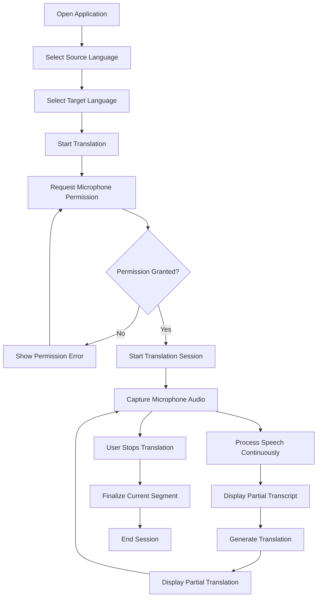
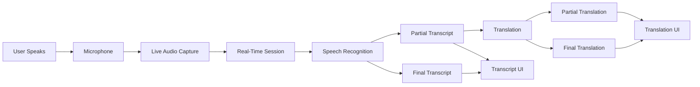

````markdown
# Product Requirements Document (PRD)

## Real-Time Audio Translation System

**Document Version:** 1.0  
**Status:** Draft  
**Document Type:** Product Requirements Document  
**Based On:** Business Requirements Document (BRD)  
**Date:** September 2026

---

## 1. Document Purpose

This Product Requirements Document defines the product behavior, user experience, functional requirements, feature scope, user flows, acceptance criteria, and product-level non-functional requirements for the Real-Time Audio Translation System.

The BRD defines **why** the product is being built and the business outcomes expected from it.

This PRD defines **what the product should do** from the perspective of the user and product.

Technical implementation details such as React architecture, FastAPI structure, WebSocket implementation, model architecture, model selection, infrastructure, and database design will be defined separately in the Architecture Design Document (ARD) and Technical Requirements/Design Document (TRD).

---

# 2. Product Overview

The Real-Time Audio Translation System is a browser-based application that allows a user to speak in one language and receive a translated representation in another language with minimal delay.

The key product difference from a traditional speech translation application is that the system should not wait for the user to finish an entire sentence before displaying useful results.

Instead, the product should continuously process speech and progressively display:

1. Source-language transcription.
2. Target-language translation.

For example:

```text
User is speaking:

"Hello, my name is John and I work..."

                ↓

Live Transcript

"Hello"
"Hello, my"
"Hello, my name"
"Hello, my name is John"
"Hello, my name is John and I work..."

                ↓

Live Translation

"Hello"
"Hello, my"
"Hello, my name"
"Hello, my name is John"
"Hello, my name is John and I work..."
````

The exact behavior of partial translation may differ depending on the selected model architecture.

---

# 3. Product Vision

The product should make spoken communication across languages feel as close to real-time as possible.

The intended experience is:

```text
Speak
  |
  v
Speech is captured
  |
  v
Speech is processed continuously
  |
  +----------------------+
  |                      |
  v                      v
Transcript            Translation
  |                      |
  +----------+-----------+
             |
             v
       Results update
       continuously
```

The user should not have to:

* Record audio.
* Stop speaking.
* Submit the recording.
* Wait for processing.
* Read the result afterward.

The product should instead provide a continuous translation experience.

---

# 4. Product Goals

## 4.1 Primary Goals

The product must:

1. Allow users to select a source language.
2. Allow users to select a target language.
3. Capture live microphone audio.
4. Process speech continuously.
5. Display partial transcription while speech is occurring.
6. Display translation with minimal practical delay.
7. Continuously update partial results.
8. Preserve finalized results.
9. Allow users to stop a translation session.
10. Support multiple supported language combinations.
11. Provide a simple and understandable interface.
12. Minimize unnecessary audio persistence.
13. Provide a foundation for future user accounts and persistent features.

---

## 4.2 Secondary Goals

The product should:

* Make latency feel as low as possible.
* Avoid confusing changes to finalized text.
* Clearly distinguish temporary and finalized results.
* Handle connection failures gracefully.
* Make microphone status clear to the user.
* Support future model changes.
* Support future authentication without requiring a complete product redesign.

---

# 5. Non-Goals

The following are not goals of the initial MVP:

* Building a full communication platform.
* Voice or video calling.
* User-to-user chat.
* User registration.
* Authentication.
* User profiles.
* Persistent translation history.
* Persistent audio recordings.
* Subscription management.
* Payments.
* Enterprise administration.
* Multi-user translation rooms.
* Advanced analytics.
* Mobile applications.
* Desktop applications.
* Custom AI model training.

These may be considered in future product phases.

---

# 6. Target Users

## 6.1 Primary User

An individual who needs to communicate using two different languages.

The user should be able to start using the core translation capability without creating an account in the initial MVP.

---

## 6.2 Potential Future Users

The product may eventually support:

* Travelers.
* International professionals.
* Customer service representatives.
* Healthcare or service interactions, subject to appropriate safety requirements.
* Educational users.
* Multilingual teams.
* Enterprise organizations.

The initial MVP does not require separate experiences for these user groups.

---

# 7. User Personas

## Persona 1: Individual User

**Goal:** Communicate with another person who speaks a different language.

**Needs:**

* Simple interface.
* Fast translation.
* Minimal configuration.
* Clear source and translated text.
* No unnecessary account creation.

---

## Persona 2: Professional User

**Goal:** Understand and respond to someone speaking another language during a live interaction.

**Needs:**

* Low latency.
* Stable transcript.
* Reliable translation.
* Clear separation between source and target language.

---

# 8. Product Scope

The initial product consists of the following major areas:

```text
+--------------------------------------------------+
|              Real-Time Translation               |
+--------------------------------------------------+
|                                                  |
|  Source Language        Target Language          |
|  [ English      ]       [ Hindi         ]        |
|                                                  |
|              [ Start Translation ]              |
|                                                  |
+--------------------------------------------------+
|              Source Transcript                   |
|                                                  |
|  Hello, my name is John and I...                 |
|                                                  |
+--------------------------------------------------+
|              Translation                         |
|                                                  |
|  नमस्ते, मेरा नाम जॉन है और मैं...               |
|                                                  |
+--------------------------------------------------+
|                                                  |
|               [ Stop Translation ]               |
|                                                  |
+--------------------------------------------------+
```

---

# 9. Core User Journey



---

# 10. User Flow

## 10.1 Starting a Translation Session

The user:

1. Opens the application.
2. Selects the source language.
3. Selects the target language.
4. Clicks **Start Translation**.
5. Grants microphone permission if required.
6. The application establishes a translation session.
7. The application begins receiving microphone input.
8. The user can begin speaking.

---

## 10.2 During Translation

While the user speaks:

```text
Microphone
    |
    v
Live Audio
    |
    v
Speech Processing
    |
    +-------------------+
    |                   |
    v                   v
Transcript          Translation
    |                   |
    +---------+---------+
              |
              v
          UI Updates
```

The UI should continuously update the current speech segment.

Example:

```text
Source:

I
I want
I want to
I want to go
I want to go to
I want to go to the market
```

The product should avoid displaying every intermediate result as a separate permanent sentence.

Instead, the active partial segment should be replaced as recognition improves.

---

# 11. Partial and Final Results

A key product requirement is distinguishing between temporary results and finalized results.

The conceptual states are:

```text
PARTIAL
   |
   | More speech arrives
   v
UPDATED PARTIAL
   |
   | Speech segment becomes stable
   v
FINAL
```

Example:

```text
Final:
"Hello, my name is John."

Partial:
"I work as a"

The next partial result may become:

"I work as a software"

Then:

"I work as a software developer."
```

The UI should keep finalized text stable while allowing the active partial text to change.

---

# 12. Transcript Display Behavior

The transcript area should conceptually contain:

```text
+---------------------------------------------+
| Source Transcript                           |
+---------------------------------------------+
|                                             |
| Hello, my name is John.                    |
|                                             |
| I work as a software developer...           |
|                                             |
+---------------------------------------------+
```

Where:

* `Hello, my name is John.` is finalized.
* `I work as a software developer...` is the active partial segment.

When the second segment becomes final:

```text
+---------------------------------------------+
| Source Transcript                           |
+---------------------------------------------+
|                                             |
| Hello, my name is John.                    |
| I work as a software developer.             |
|                                             |
+---------------------------------------------+
```

A new partial segment can then be created.

---

# 13. Translation Display Behavior

Translation should follow the same conceptual model.

```text
+---------------------------------------------+
| Translation                                 |
+---------------------------------------------+
|                                             |
| नमस्ते, मेरा नाम जॉन है।                    |
|                                             |
| मैं एक सॉफ्टवेयर डेवलपर के रूप में काम...   |
|                                             |
+---------------------------------------------+
```

Finalized translations should remain stable.

The active translation may change as more source speech becomes available.

---

# 14. Language Selection

The user must be able to select:

### Source Language

The language being spoken.

### Target Language

The language into which the speech should be translated.

Example:

```text
Source Language
[ English ▼ ]

        ↓

Target Language
[ Hindi ▼ ]
```

The available language combinations depend on the capabilities of the selected models.

---

# 15. Language Selection Rules

The product should:

1. Prevent starting a session without a source language.
2. Prevent starting a session without a target language.
3. Prevent unsupported language combinations.
4. Prevent source and target languages from being identical unless there is a defined product reason to allow it.
5. Clearly communicate unsupported language combinations.

---

# 16. Translation Session

A translation session represents one continuous real-time translation interaction.

Conceptually:

```text
Session Created
      |
      v
Session Active
      |
      +--> Audio Streaming
      |
      +--> Transcript Events
      |
      +--> Translation Events
      |
      v
Session Stopped
      |
      v
Session Closed
```

The initial MVP session exists only for the duration of the interaction.

No persistent session record is required.

---

# 17. Session States

The product should support the following conceptual states:

```text
IDLE
 |
 | Start
 v
CONNECTING
 |
 | Connection successful
 v
ACTIVE
 |
 | Stop
 v
ENDING
 |
 v
IDLE
```

Error states may occur from any appropriate stage:

```text
CONNECTING
     |
     v
   ERROR
     |
     v
  RETRY / IDLE
```

---

# 18. User Interface States

The interface should provide clear feedback for:

### Idle

```text
Select languages
[ Start Translation ]
```

### Connecting

```text
Connecting...
```

### Listening

```text
Listening...
```

### Processing

```text
Translating...
```

### Active

```text
Live translation in progress

[ Source Transcript ]

[ Translation ]

[ Stop Translation ]
```

### Error

```text
Unable to connect to the translation service.

[ Try Again ]
```

---

# 19. Microphone Permission

The application requires microphone access to perform live translation.

If permission has not been granted:

```text
Start Translation
        |
        v
Microphone Permission
        |
        +---- Granted ----> Translation
        |
        +---- Denied -----> Permission Error
```

The product should provide a clear explanation that microphone access is required.

---

# 20. Error Handling Requirements

The product should handle common failure conditions gracefully.

Potential failures include:

### Microphone Failure

The application cannot access the user's microphone.

Expected behavior:

* Inform the user.
* Do not start the translation session.
* Provide an actionable recovery path.

### Connection Failure

The real-time connection cannot be established or is lost.

Expected behavior:

* Show connection status.
* Stop or pause processing safely.
* Allow the user to retry.

### Model Failure

The AI processing layer becomes unavailable.

Expected behavior:

* Show a generic user-friendly error.
* Avoid exposing internal implementation details.
* Clean up the active session.

### Unsupported Language

Expected behavior:

* Prevent session startup.
* Explain that the selected language combination is unavailable.

### Unexpected Session Termination

Expected behavior:

* Clean up temporary resources.
* Return the UI to an appropriate state.
* Allow the user to start another session.

---

# 21. Real-Time Experience Requirements

Real-time behavior is a core product requirement.

The system should provide:

```text
User speaks
     |
     | very small delay
     v
Partial transcript
     |
     | minimal additional delay
     v
Partial translation
```

The product should avoid this experience:

```text
User speaks entire sentence
             |
             v
Wait
             |
             v
Transcription
             |
             v
Wait
             |
             v
Translation
```

The exact measurable latency targets will be established during technical design and performance benchmarking.

---

# 22. Latency Requirements

The product should track at least:

### Time to First Transcript

Time between speech becoming available to the system and the first meaningful transcript result.

### Time to First Translation

Time between speech becoming available and the first meaningful translated result.

### Update Latency

Time required for subsequent speech to appear in updated results.

### End-to-End Latency

```text
Audio Capture
      ↓
Transmission
      ↓
Speech Recognition
      ↓
Translation
      ↓
UI Update
```

The initial PRD does not prescribe a specific numerical latency because it depends on model selection, hardware, audio configuration, and deployment environment.

A target should be finalized after baseline benchmarking.

---

# 23. Audio Requirements

The product should:

* Capture microphone audio continuously.
* Process audio in small chunks suitable for real-time processing.
* Avoid unnecessary audio buffering.
* Avoid permanently storing raw audio in the initial MVP.
* Release audio-related resources when a session ends.

The exact audio format, sample rate, chunk size, and preprocessing requirements belong in the TRD.

---

# 24. Privacy Requirements

The initial product should follow a data-minimization approach.

### Raw Audio

Raw microphone audio should not be permanently stored by default.

### Transcripts

The initial MVP should not persist transcripts after the session ends unless explicitly required by a future feature.

### Translation

The initial MVP should not persist translation history.

Conceptually:

```text
Microphone
    |
    v
Temporary Audio Processing
    |
    v
Transcript / Translation
    |
    v
UI
    |
    v
Session Ends
    |
    v
Temporary Session Data Released
```

---

# 25. Model Flexibility

The product should not depend on one specific AI model as a permanent product requirement.

Two conceptual approaches may be evaluated.

## Approach A: Cascaded Translation

```text
Audio
  |
  v
Streaming STT
  |
  v
Partial Transcript
  |
  v
Translation Model
  |
  v
Translated Text
```

Advantages:

* Individual components can be replaced independently.
* STT and translation models can be evaluated separately.
* Easier to experiment with different model combinations.

Potential challenge:

* Translation may lag behind transcription.
* Incremental translation can be more difficult.

---

## Approach B: Unified Speech Translation

```text
Audio
  |
  v
Unified Streaming
Speech Translation Model
  |
  +----------------+
  |                |
  v                v
Transcript      Translation
```

Advantages:

* Potentially more natural simultaneous translation.
* Model can optimize speech translation as one process.

Potential challenges:

* Larger model requirements.
* More complex model/runtime requirements.
* Model availability and licensing must be evaluated.
* Less flexibility if the model is tightly coupled.

The final approach will be selected during technical design and model evaluation.

---

# 26. Feature Requirements

## Feature F-001: Language Selection

**Description:**
Allow the user to select source and target languages.

**Priority:** Must Have

**Acceptance Criteria:**

* Source language can be selected.
* Target language can be selected.
* Unsupported combinations are rejected.
* Selected languages are visible before the session begins.

---

## Feature F-002: Start Translation

**Description:**
Allow the user to start a real-time translation session.

**Priority:** Must Have

**Acceptance Criteria:**

* Session starts successfully when valid languages are selected.
* Microphone permission is requested when necessary.
* UI displays an active/connecting state.
* Audio capture begins after the session is established.

---

## Feature F-003: Live Audio Capture

**Description:**
Capture microphone audio continuously.

**Priority:** Must Have

**Acceptance Criteria:**

* Browser can capture microphone input.
* Audio is streamed continuously.
* Audio is not unnecessarily persisted.
* Audio resources are released when the session ends.

---

## Feature F-004: Live Transcription

**Description:**
Display speech transcription while the user is speaking.

**Priority:** Must Have

**Acceptance Criteria:**

* Partial transcript appears before the speaker finishes.
* Partial transcript updates as speech continues.
* Finalized segments remain stable.
* New speech creates new or updated segments.

---

## Feature F-005: Live Translation

**Description:**
Translate recognized speech into the selected target language.

**Priority:** Must Have

**Acceptance Criteria:**

* Translation appears during the session.
* Translation updates as additional speech becomes available.
* Final translations remain stable.
* Translation corresponds to the source transcript.

---

## Feature F-006: Stop Translation

**Description:**
Allow the user to stop the active translation session.

**Priority:** Must Have

**Acceptance Criteria:**

* Audio capture stops.
* Session closes cleanly.
* Temporary resources are released.
* UI returns to an appropriate inactive state.

---

## Feature F-007: Session Status

**Description:**
Provide feedback about the current translation state.

**Priority:** Must Have

**Acceptance Criteria:**

The UI communicates states such as:

* Connecting.
* Active/listening.
* Processing.
* Error.
* Ending.

---

## Feature F-008: Error Handling

**Description:**
Handle common failures without crashing the application.

**Priority:** Must Have

**Acceptance Criteria:**

* User receives understandable error messages.
* Failed sessions can be terminated safely.
* User can retry where appropriate.

---

# 27. Feature Prioritization

| Feature                   | Priority  | MVP |
| ------------------------- | --------- | --- |
| Source language selection | Must Have | Yes |
| Target language selection | Must Have | Yes |
| Microphone capture        | Must Have | Yes |
| Real-time audio streaming | Must Have | Yes |
| Partial transcription     | Must Have | Yes |
| Final transcription       | Must Have | Yes |
| Incremental translation   | Must Have | Yes |
| Final translation         | Must Have | Yes |
| Session management        | Must Have | Yes |
| Error handling            | Must Have | Yes |
| Translation history       | Future    | No  |
| User registration         | Future    | No  |
| Authentication            | Future    | No  |
| User profiles             | Future    | No  |
| Saved preferences         | Future    | No  |
| Multi-user sessions       | Future    | No  |
| Billing                   | Future    | No  |
| Analytics dashboard       | Future    | No  |

---

# 28. Functional Requirements

## FR-001

The system shall allow the user to select a supported source language.

## FR-002

The system shall allow the user to select a supported target language.

## FR-003

The system shall validate the selected language combination before starting a session.

## FR-004

The system shall request microphone access when required.

## FR-005

The system shall establish a real-time translation session.

## FR-006

The system shall continuously capture microphone audio during an active session.

## FR-007

The system shall continuously process incoming speech.

## FR-008

The system shall provide partial transcription results.

## FR-009

The system shall update partial transcription as improved recognition results become available.

## FR-010

The system shall finalize completed transcript segments.

## FR-011

The system shall translate recognized speech into the selected target language.

## FR-012

The system shall provide translation results during the active session.

## FR-013

The system shall update partial translation where supported by the selected translation architecture.

## FR-014

The system shall finalize completed translation segments.

## FR-015

The system shall allow the user to stop the translation session.

## FR-016

The system shall release temporary session resources when a session ends.

## FR-017

The system shall provide appropriate feedback when an error occurs.

## FR-018

The system shall prevent unsupported language combinations from being used.

---

# 29. Non-Functional Product Requirements

## NFR-001: Responsiveness

The product should provide translation results with low perceived latency.

## NFR-002: Reliability

The application should recover gracefully from temporary connection or processing failures.

## NFR-003: Usability

A user should be able to start a translation session without requiring technical knowledge.

## NFR-004: Privacy

The system should avoid unnecessary persistence of microphone audio and translation data.

## NFR-005: Scalability

The product architecture should allow future support for multiple simultaneous users.

## NFR-006: Extensibility

The system should support future model replacement and additional language support.

## NFR-007: Maintainability

The product should have clear boundaries between UI, real-time communication, session handling, and AI processing.

## NFR-008: Compatibility

The product should target modern browsers capable of providing microphone access and real-time communication.

---

# 30. Accessibility Requirements

The initial MVP should consider:

* Clear labels for language selectors.
* Keyboard-accessible controls.
* Visible focus states.
* Readable text.
* Sufficient contrast.
* Clear error messages.
* Non-color-only indicators for system states.

Accessibility requirements can be expanded during UI/UX design.

---

# 31. Product-Level Security Requirements

The initial MVP should:

* Use secure communication in production.
* Avoid exposing internal model/runtime details to users.
* Validate incoming requests.
* Prevent unauthorized access to active sessions where applicable.
* Avoid unnecessary storage of audio.
* Protect model/service configuration.
* Avoid exposing secrets to the browser.

Detailed security architecture will be defined separately.

---

# 32. Product Data Requirements

For the initial MVP, persistent data storage is not required.

The product may maintain temporary runtime information such as:

```text
Session
├── Session ID
├── Source Language
├── Target Language
├── Connection State
├── Current Transcript Segment
└── Current Translation Segment
```

This information exists only as required for the active session.

Future versions may introduce:

```text
User
 |
 +---- Translation Sessions
          |
          +---- Transcript
          |
          +---- Translation
```

---

# 33. Analytics and Monitoring

The initial MVP should prioritize technical monitoring over business analytics.

Potential technical metrics include:

* Session start count.
* Session completion count.
* Session failure count.
* Connection failures.
* Time to first transcript.
* Time to first translation.
* End-to-end latency.
* Model processing time.
* Resource usage.

Detailed product analytics can be introduced after the core workflow is stable.

---

# 34. MVP Definition

The MVP is complete when a user can perform the following end-to-end flow:

```text
Open Application
       |
       v
Select English
       |
       v
Select Hindi
       |
       v
Start Translation
       |
       v
Allow Microphone
       |
       v
Speak:
"Hello, how are you?"
       |
       v
See partial transcript
       |
       v
See partial translation
       |
       v
Continue speaking
       |
       v
Results stabilize
       |
       v
Stop Translation
```

The MVP does not require:

```text
Registration
Authentication
Database
Payment
Translation History
Admin Panel
Subscriptions
```

---

# 35. MVP Acceptance Criteria

The MVP must satisfy the following:

### AC-001

The user can select a source language.

### AC-002

The user can select a target language.

### AC-003

The user can start a translation session.

### AC-004

The application can obtain microphone input.

### AC-005

Audio is processed continuously.

### AC-006

Partial transcript appears while the user is speaking.

### AC-007

Partial transcript can change as recognition improves.

### AC-008

Finalized transcript segments remain stable.

### AC-009

Translated text appears during the session.

### AC-010

Translation can update incrementally where supported.

### AC-011

Finalized translation segments remain stable.

### AC-012

The user can stop the session.

### AC-013

The application handles microphone, connection, and processing errors gracefully.

### AC-014

Raw audio is not permanently stored by default.

### AC-015

The system can support more than one supported language combination.

### AC-016

The implementation provides measurable latency metrics for future optimization.

---

# 36. Product Success Metrics

The initial MVP should be evaluated using:

## User Experience

* Can a new user start a translation session without assistance?
* Does the interface clearly show what is happening?
* Is partial text understandable?
* Does the system feel real-time?

## Technical/Product Performance

```text
Time to First Transcript
        ↓
Time to First Translation
        ↓
Update Frequency
        ↓
Final Result Accuracy
        ↓
Session Reliability
```

## Quality

The product should evaluate:

* Speech recognition quality.
* Translation quality.
* Partial-result stability.
* Final-result stability.
* Language coverage.

---

# 37. Edge Cases

The product should account for:

### User Does Not Speak

The session remains active without generating meaningless content.

### Very Short Speech

Short utterances should still be processed correctly.

### Long Continuous Speech

The system should create manageable segments rather than generating one indefinitely growing transcript.

### User Pauses

A pause may cause a segment to become final depending on the speech processing behavior.

### User Changes Language

Unexpected language changes may result in reduced recognition quality. Automatic language switching is not required for the initial MVP.

### Background Noise

The system should attempt to process speech appropriately, but extremely noisy environments may reduce accuracy.

### Network Interruption

The application should detect the failure and provide an appropriate error/reconnection state.

### Model Processing Delay

The UI should communicate that processing is occurring rather than appearing frozen.

---

# 38. Product Flow: Complete Real-Time Pipeline



---

# 39. Product Architecture Boundary

The PRD does not define the exact technical architecture, but the product requires the following logical capabilities:

```text
+-------------------+
|   User Interface  |
+---------+---------+
          |
          | Real-Time Interaction
          v
+-------------------+
| Translation       |
| Session           |
+---------+---------+
          |
          v
+-------------------+
| Speech Processing |
+---------+---------+
          |
          v
+-------------------+
| Translation       |
| Processing        |
+---------+---------+
          |
          v
+-------------------+
| User Interface    |
| Updates           |
+-------------------+
```

The exact implementation of these components belongs to the ARD/TRD.

---

# 40. Future Product Evolution

The product can evolve from the MVP:

```text
                    MVP
                     |
                     v
        Real-Time Translation
                     |
          +----------+----------+
          |                     |
          v                     v
      Accounts             History
          |                     |
          v                     v
     User Profiles       Saved Sessions
          |                     |
          +----------+----------+
                     |
                     v
              Advanced Sessions
                     |
          +----------+----------+
          |                     |
          v                     v
     Multi-User             Enterprise
      Sessions              Features
```

Potential future capabilities include:

* User registration.
* Authentication.
* Persistent translation history.
* User preferences.
* Multiple participants.
* Speaker identification.
* Conversation management.
* Translation export.
* Mobile applications.
* Enterprise accounts.
* Usage controls.
* Subscription plans.
* Advanced analytics.

---

# 41. Dependencies

The product depends on:

1. Browser microphone support.
2. Real-time communication capability.
3. Speech recognition capability.
4. Translation capability.
5. Supported source/target language combinations.
6. Adequate compute resources.
7. Appropriate model licensing.
8. Reliable communication between application components.

---

# 42. Risks

| Risk                                    | Product Impact                          | Mitigation                                    |
| --------------------------------------- | --------------------------------------- | --------------------------------------------- |
| High latency                            | Product does not feel real-time         | Benchmark and optimize the complete pipeline  |
| Unstable partial transcript             | Difficult to read                       | Implement partial/stable/final result states  |
| Translation waits for complete sentence | Delayed translation                     | Evaluate incremental/streaming translation    |
| Poor translation quality                | User cannot rely on output              | Evaluate models across target languages       |
| Poor microphone quality                 | Reduced transcription accuracy          | Audio preprocessing and clear input guidance  |
| Large model requirements                | Difficult deployment                    | Evaluate optimized/smaller models             |
| Limited language support                | Reduced usefulness                      | Select models with required language coverage |
| Model licensing                         | Product cannot be commercially deployed | Perform license review                        |
| Connection failures                     | Interrupted sessions                    | Clear state management and recovery           |
| High concurrent load                    | System instability                      | Load testing and resource controls            |

---

# 43. Product Decisions Pending Technical Validation

The following decisions should not be permanently fixed in the PRD:

### Model Architecture

* Cascaded STT + translation.
* Unified speech translation.

### Exact Models

The final models will be selected based on:

* Accuracy.
* Latency.
* Hardware requirements.
* Language support.
* License.
* Ease of self-hosting.

### Latency Target

A measurable target will be established after benchmarking.

### Audio Configuration

Sample rate, encoding, chunk duration, and preprocessing will be defined technically.

### Deployment Infrastructure

The final compute requirements will be established after model benchmarking.

---

# 44. Requirements Traceability

The relationship between the BRD and PRD is:

```text
BRD
 |
 +-- Business Objective
 |       |
 |       v
 |     Product Goal
 |       |
 |       v
 |     Feature
 |       |
 |       v
 |     Requirement
 |       |
 |       v
 |     Acceptance Criteria
 |
 +-- Business Constraint
         |
         v
      Product Constraint
```

Example:

```text
BRD:
Provide real-time speech translation
        |
        v
PRD Goal:
Translate speech while the user is speaking
        |
        v
Feature:
Live transcription
        |
        v
Requirement:
Display partial transcript
        |
        v
Acceptance:
Partial transcript appears before the user
finishes speaking
```

---

# 45. Relationship With Technical Documents

This PRD should be followed by technical design documents.

| Document               | Responsibility                     |
| ---------------------- | ---------------------------------- |
| BRD                    | Why the business needs the product |
| PRD                    | What the product should do         |
| SRS                    | Detailed software requirements     |
| ARD                    | Overall system architecture        |
| TRD                    | Detailed technical implementation  |
| API/WebSocket Contract | Component communication            |
| UI/UX Specification    | Detailed interface design          |
| Test Plan              | Verification and validation        |
| Deployment Design      | Runtime infrastructure             |
| ADRs                   | Important technical decisions      |

---

# 46. Document Change History

| Version | Date           | Description |
| ------- | -------------- | ----------- |
| 1.0     | September 2026 | Initial PRD |

---

# 47. Approval

**Product Owner:** ____________________

**Technical Lead:** ____________________

**Date:** ____________________

**Approval Status:** ____________________

```
```
