# Software Requirements Specification (SRS)

## Real-Time Audio Translation System

**Document Version:** 1.0
**Status:** Draft
**Document Type:** Software Requirements Specification
**Last Updated:** September 2026

---

## 1. Introduction

### 1.1 Purpose

This Software Requirements Specification (SRS) defines the functional and non-functional requirements for the **Real-Time Audio Translation System**.

The system is a web-based application that captures spoken audio from a user's microphone, processes the audio in real time, identifies the spoken language, converts speech to text, translates the spoken content into a target language, and continuously displays the results to the user.

The primary objective is to provide a low-latency translation experience where the user can see the source transcription and translated text **while the speaker is still speaking**, rather than waiting for the speaker to finish an entire sentence.

The initial implementation will focus on the core real-time translation functionality without persistent user accounts or a database. Authentication and user management will be introduced in a later phase.

---

### 1.2 Scope

The system will initially provide:

* Browser-based microphone audio capture
* Real-time audio streaming from frontend to backend
* WebSocket-based communication
* Real-time speech-to-text processing
* Real-time translation
* Partial and final transcription results
* Partial and final translation results
* Support for configurable source and target languages
* Continuous UI updates while speech is in progress
* Independent real-time translation sessions
* Local/self-hosted AI models
* GPU acceleration where available
* No persistent audio storage by default

The initial implementation will **not** include:

* User registration
* User login
* Persistent user profiles
* Subscription/payment functionality
* Persistent conversation history
* Database-backed session storage
* Cloud-based paid AI APIs

These capabilities may be introduced in subsequent versions.

---

### 1.3 Product Vision

The system should provide an experience similar to:

```text
Speaker starts speaking
        |
        v
Microphone captures audio
        |
        v
Audio is streamed continuously
        |
        v
Speech recognition begins
        |
        v
Partial transcript appears
        |
        v
Translation begins incrementally
        |
        v
Partial translation appears
        |
        v
Speaker continues speaking
        |
        v
Existing partial text is refined
        |
        v
Final transcript + translation
```

The key requirement is that the system should **not require the speaker to finish an entire sentence before producing useful output**.

---

## 2. Overall System Description

### 2.1 Product Perspective

The system consists of two primary applications:

1. **Frontend**

   * React
   * Browser-based
   * Responsible for microphone access, audio processing, WebSocket communication, and displaying translation results.

2. **Backend**

   * Python
   * FastAPI
   * Responsible for WebSocket connections, audio processing orchestration, model execution, session management, and returning translation events.

High-level architecture:

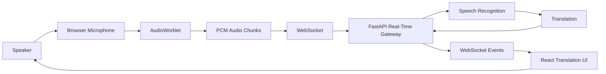

---

### 2.2 Product Functions

The system will provide the following major functions:

| Function               | Description                                                   |
| ---------------------- | ------------------------------------------------------------- |
| Microphone Capture     | Capture audio from the user's microphone                      |
| Audio Processing       | Convert and prepare audio for model processing                |
| Audio Streaming        | Stream small audio chunks to the backend                      |
| Session Management     | Create and maintain an active translation session             |
| Speech Recognition     | Convert spoken audio into text                                |
| Translation            | Translate recognized speech into the selected target language |
| Partial Results        | Display intermediate results while speech continues           |
| Final Results          | Display finalized transcript and translation                  |
| Language Configuration | Allow source and target language selection                    |
| Connection Management  | Detect and handle WebSocket connection states                 |
| Error Handling         | Report recoverable and unrecoverable errors                   |

---

## 3. User Classes and Characteristics

### 3.1 General User

The primary user is a person who wants to translate spoken language in real time.

The user should not require technical knowledge about:

* AI models
* Speech recognition
* WebSockets
* Audio codecs
* Backend processing

The interface should expose only the controls required for translation.

---

### 3.2 System Administrator

The initial MVP does not provide an administrative UI.

However, the backend should be structured so that administrative capabilities can be added later.

Potential future capabilities include:

* Model configuration
* Model health monitoring
* Usage monitoring
* User management
* Session monitoring
* Provider/model configuration
* System-level configuration

---

## 4. System Architecture

### 4.1 High-Level Architecture

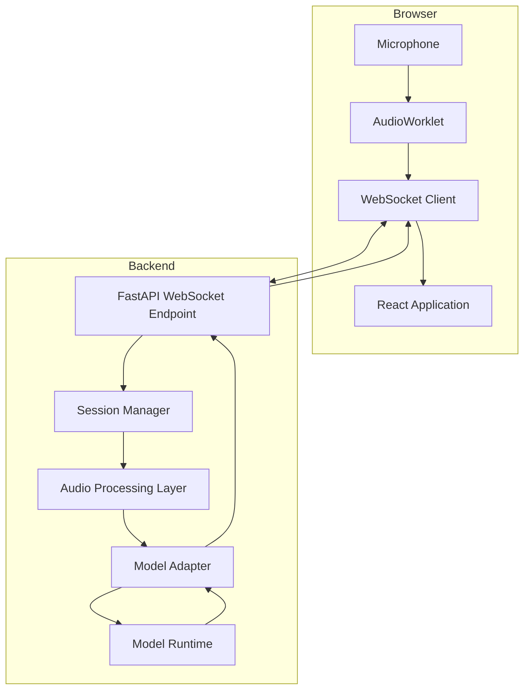

---

### 4.2 Frontend Responsibilities

The frontend shall:

* Request microphone permission.
* Capture microphone audio.
* Process audio using browser audio APIs.
* Convert audio into suitable PCM chunks.
* Establish WebSocket connection.
* Send audio chunks to backend.
* Receive server events.
* Display partial transcription.
* Display final transcription.
* Display partial translation.
* Display final translation.
* Display connection state.
* Display errors.
* Allow source and target language configuration.
* Allow users to start and stop translation.

---

### 4.3 Backend Responsibilities

The backend shall:

* Accept WebSocket connections.
* Create translation sessions.
* Validate incoming session configuration.
* Receive audio chunks.
* Process incoming audio.
* Pass audio to the selected model pipeline.
* Normalize model-specific output.
* Generate standardized events.
* Send events to the frontend.
* Handle session termination.
* Release model/session resources.

---

## 5. Functional Requirements

## FR-001: Start Translation Session

The system shall allow a user to start a real-time translation session.

### Preconditions

* Browser supports microphone access.
* User grants microphone permission.
* Backend is available.

### Input

```json
{
  "source_language": "en",
  "target_language": "hi"
}
```

### Expected Behavior

The frontend shall establish a WebSocket connection and send session configuration.

The backend shall create a session and return a `session_started` event.

Example:

```json
{
  "event": "session_started",
  "session_id": "session-123",
  "source_language": "en",
  "target_language": "hi"
}
```

---

## FR-002: Microphone Permission

The frontend shall request microphone access using the browser's media APIs.

If permission is denied, the system shall:

1. Stop the translation process.
2. Display an appropriate error.
3. Avoid opening an active audio-processing session.

Example:

```text
Microphone access is required to start translation.
```

---

## FR-003: Audio Capture

The system shall capture microphone audio continuously while a translation session is active.

Audio capture should use browser-native audio APIs and an `AudioWorklet` or equivalent low-latency mechanism.

The system should avoid unnecessarily large audio buffers.

---

## FR-004: Audio Chunking

The frontend shall divide the captured audio into small chunks before transmission.

Conceptually:

```text
Microphone
    |
    v
Continuous Audio Stream
    |
    +--> Chunk 1
    +--> Chunk 2
    +--> Chunk 3
    +--> Chunk 4
    +--> ...
```

The exact chunk size shall be configurable based on latency and model requirements.

---

## FR-005: Audio Transmission

Audio chunks shall be transmitted from the browser to the backend through a WebSocket connection.

The frontend shall not wait for an entire sentence before sending audio.

```text
Audio Chunk 1 --> Backend
Audio Chunk 2 --> Backend
Audio Chunk 3 --> Backend
Audio Chunk 4 --> Backend
```

---

## FR-006: WebSocket Communication

The system shall use WebSockets for bidirectional real-time communication.

The WebSocket channel shall support:

### Client → Server

```text
session_start
audio_chunk
session_stop
```

### Server → Client

```text
session_started
transcript
translation
error
session_ended
```

---

## FR-007: Speech Recognition

The backend shall process incoming audio using a speech recognition model.

The speech recognition system shall support incremental results where possible.

Example:

```text
Audio:
"Hello my name is..."

Result 1:
"Hello"

Result 2:
"Hello my"

Result 3:
"Hello my name"

Result 4:
"Hello my name is"
```

The frontend shall update the active partial transcript instead of creating a new permanent line for every intermediate result.

---

## FR-008: Transcript Status

Transcript events shall indicate whether the result is:

* Partial
* Final

Example:

```json
{
  "event": "transcript",
  "segment_id": 1,
  "text": "Hello my name",
  "status": "partial"
}
```

Final result:

```json
{
  "event": "transcript",
  "segment_id": 1,
  "text": "Hello my name is John",
  "status": "final"
}
```

---

## FR-009: Segment Identification

Each logical speech segment shall have a unique `segment_id` within the session.

This allows the frontend to determine which partial result should be replaced.

Example:

```text
segment_id = 1

Partial:
Hello

Partial:
Hello my

Partial:
Hello my name

Final:
Hello my name is John
```

The frontend maintains only one active representation for segment `1`.

---

## FR-010: Translation

The system shall translate recognized speech into the selected target language.

For the cascaded architecture:

```text
Audio
  |
  v
Streaming STT
  |
  v
Partial Transcript
  |
  v
Translation Model
  |
  v
Partial Translation
```

The translation system should begin processing before the entire conversation is completed.

---

## FR-011: Translation Status

Translation events shall contain a status.

Example:

```json
{
  "event": "translation",
  "segment_id": 1,
  "source_text": "Hello my name",
  "translated_text": "नमस्ते मेरा नाम",
  "status": "partial"
}
```

Final:

```json
{
  "event": "translation",
  "segment_id": 1,
  "source_text": "Hello my name is John",
  "translated_text": "नमस्ते मेरा नाम जॉन है",
  "status": "final"
}
```

---

## FR-012: Partial Result Replacement

The frontend shall replace the active partial segment when a newer result for the same `segment_id` arrives.

It shall not produce:

```text
Hello
Hello my
Hello my name
Hello my name is John
```

as four independent final lines.

Instead:

```text
Hello my name is John
```

shall ultimately remain as the final segment.

---

## FR-013: Final Result Handling

When the backend sends a final event:

```json
{
  "status": "final"
}
```

the frontend shall:

1. Mark the segment as finalized.
2. Stop replacing that segment.
3. Create a new active segment for subsequent speech.

---

## FR-014: Source Language

The system shall allow the user to specify the source language.

Example:

```text
English
Hindi
Spanish
French
German
...
```

The actual supported language list shall depend on the selected model.

---

## FR-015: Target Language

The system shall allow the user to specify the target language.

The target language shall be independent from the source language.

Example:

```text
Source: English
Target: Hindi
```

or:

```text
Source: Hindi
Target: English
```

---

## FR-016: Language Validation

The backend shall validate requested source and target languages.

If a requested language is unsupported, the server shall return an error.

Example:

```json
{
  "event": "error",
  "code": "UNSUPPORTED_LANGUAGE",
  "message": "The selected language is not supported."
}
```

---

## FR-017: Session Isolation

Each active translation session shall have its own session state.

Conceptually:

```text
Session A
    |
    +-- Audio
    +-- Model State
    +-- Segments

Session B
    |
    +-- Audio
    +-- Model State
    +-- Segments
```

One user's audio or transcript must not be sent to another user's session.

---

## FR-018: Session Termination

The user shall be able to stop an active translation session.

When stopped:

1. Audio capture shall stop.
2. Audio transmission shall stop.
3. Model processing shall stop.
4. Session resources shall be released.
5. Backend shall send a `session_ended` event where applicable.

---

## FR-019: WebSocket Disconnect

If the client disconnects unexpectedly, the backend shall detect the disconnection and clean up the associated session.

The backend shall not keep abandoned model sessions running indefinitely.

---

## FR-020: Error Handling

The system shall handle at least the following errors:

* Microphone permission denied
* Microphone unavailable
* WebSocket connection failure
* WebSocket disconnection
* Invalid audio data
* Unsupported language
* Model initialization failure
* Model inference failure
* Session timeout
* Server overload

---

## FR-021: Error Events

Backend errors shall use a standardized format.

```json
{
  "event": "error",
  "code": "MODEL_ERROR",
  "message": "Unable to process audio."
}
```

The frontend shall display user-friendly error messages while avoiding unnecessary internal implementation details.

---

## FR-022: Model Adapter

The backend shall use a model adapter abstraction to isolate the application from a specific AI model implementation.

Conceptually:

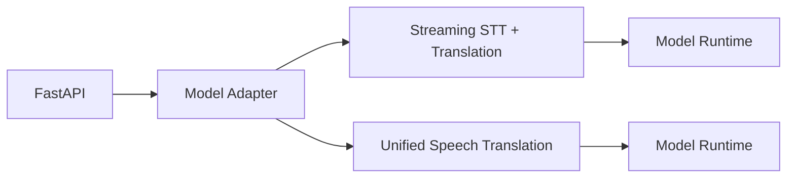

A common interface should allow different model implementations to be substituted without significantly changing the WebSocket/API layer.

---

## FR-023: Model Adapter Interface

The model adapter should conceptually support:

```python
class ModelAdapter:

    async def start_session(...):
        pass

    async def push_audio(...):
        pass

    async def receive_events(...):
        pass

    async def end_session(...):
        pass
```

The exact implementation may vary depending on the selected model architecture.

---

## FR-024: Event Normalization

Different models may generate different output formats.

The backend shall normalize these outputs into a common application-level event format.

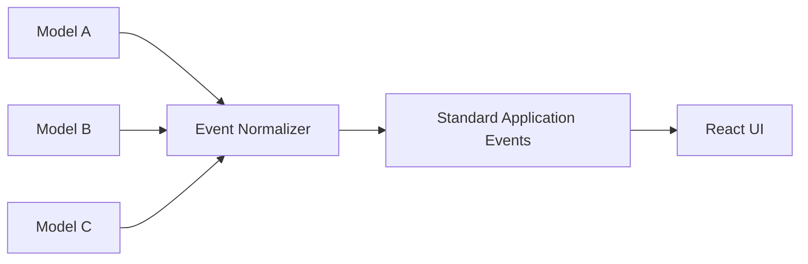

This prevents the frontend from becoming dependent on a specific model.

---

## 6. Event Protocol

### 6.1 General Event Structure

Events should follow a common structure.

```json
{
  "event": "event_name",
  "session_id": "session-123",
  "timestamp": 1726310000,
  "data": {}
}
```

The exact schema may be refined during implementation.

---

### 6.2 Session Started

```json
{
  "event": "session_started",
  "session_id": "abc123",
  "source_language": "en",
  "target_language": "hi"
}
```

---

### 6.3 Transcript Event

```json
{
  "event": "transcript",
  "session_id": "abc123",
  "segment_id": 1,
  "status": "partial",
  "text": "Hello my name"
}
```

---

### 6.4 Translation Event

```json
{
  "event": "translation",
  "session_id": "abc123",
  "segment_id": 1,
  "status": "partial",
  "source_text": "Hello my name",
  "translated_text": "नमस्ते मेरा नाम"
}
```

---

### 6.5 Final Event

```json
{
  "event": "translation",
  "session_id": "abc123",
  "segment_id": 1,
  "status": "final",
  "source_text": "Hello my name is John",
  "translated_text": "नमस्ते मेरा नाम जॉन है"
}
```

---

### 6.6 Error Event

```json
{
  "event": "error",
  "code": "INVALID_AUDIO",
  "message": "Unable to process the received audio."
}
```

---

## 7. User Interface Requirements

### 7.1 Main Screen

The initial UI should contain:

```text
+------------------------------------------------+
|           Real-Time Audio Translator            |
+------------------------------------------------+

 Source Language        Target Language
 [ English v ]          [ Hindi v ]

+------------------------------------------------+
|                                                |
|  Source Transcript                             |
|                                                |
|  Hello my name is John                         |
|                                                |
+------------------------------------------------+

+------------------------------------------------+
|                                                |
|  Translation                                   |
|                                                |
|  नमस्ते मेरा नाम जॉन है                       |
|                                                |
+------------------------------------------------+

             [ Start Translation ]

Status: Connected
```

---

### 7.2 Translation State

The UI shall clearly indicate:

* Ready
* Connecting
* Listening
* Processing
* Disconnected
* Error

---

### 7.3 Partial Text

Partial text should visually behave differently from finalized text if required.

Conceptually:

```text
Final text:
Hello my name

Active partial text:
is John
```

The exact visual design can be finalized during UI/UX implementation.

---

## 8. Non-Functional Requirements

## NFR-001: Low Latency

The system shall prioritize low end-to-end latency.

The target is to begin displaying useful transcription/translation shortly after speech is detected rather than waiting for complete sentences.

The exact latency target shall be established through benchmarking during implementation.

---

## NFR-002: Real-Time Processing

Audio shall be processed continuously rather than through large batch requests.

The system shall avoid architectures that require:

```text
Record entire audio
        |
        v
Upload entire file
        |
        v
Process
        |
        v
Return result
```

The preferred architecture is:

```text
Audio Chunk
   |
   v
Process
   |
   v
Result
   |
   v
Next Audio Chunk
```

---

## NFR-003: Scalability

The backend should be designed so multiple translation sessions can run concurrently.

The architecture should avoid storing session state in global variables.

Session-specific resources shall be isolated.

---

## NFR-004: Reliability

Unexpected client disconnections shall not leave persistent model sessions running.

The backend shall clean up resources when a session ends.

---

## NFR-005: Security

The system shall:

* Use secure WebSockets (`wss`) in production.
* Validate incoming WebSocket messages.
* Validate audio data.
* Validate language configuration.
* Avoid exposing internal model details unnecessarily.
* Avoid storing raw audio by default.
* Prevent cross-session data leakage.

---

## NFR-006: Privacy

Raw microphone audio shall not be persisted by default.

The default processing path should be:

```text
Microphone
   |
   v
Memory
   |
   v
Model
   |
   v
Result
   |
   v
Discard audio
```

Persistent audio storage may be introduced later as an explicitly enabled feature.

---

## NFR-007: Maintainability

The backend shall use modular components.

A possible structure:

```text
backend/
├── src/
│   └── app/
│       ├── api/
│       ├── audio/
│       ├── config/
│       ├── models/
│       ├── services/
│       ├── sessions/
│       ├── schemas/
│       ├── adapters/
│       └── main.py
│
├── tests/
├── Dockerfile
├── pyproject.toml
└── README.md
```

The exact structure can evolve during implementation.

---

## NFR-008: Model Independence

The application layer should not depend directly on a specific model implementation.

The model adapter abstraction should allow:

```text
Model A
   |
   v
Adapter A
   |
   v
Common Interface
```

to be replaced with:

```text
Model B
   |
   v
Adapter B
   |
   v
Common Interface
```

without redesigning the frontend.

---

## NFR-009: Hardware Acceleration

The backend should support GPU-based inference where compatible hardware is available.

The application should also provide a CPU-compatible configuration where practical.

---

## NFR-010: Configuration

Model and runtime configuration shall not be hardcoded throughout the application.

Configuration should be managed through environment variables and application settings.

Examples:

```text
MODEL_NAME
MODEL_DEVICE
MODEL_DTYPE
SUPPORTED_LANGUAGES
AUDIO_SAMPLE_RATE
WEBSOCKET_TIMEOUT
```

---

## NFR-011: Observability

The backend should provide structured logging for:

* Session creation
* Session termination
* WebSocket connection
* WebSocket disconnection
* Model initialization
* Model errors
* Processing errors
* Latency measurements

Sensitive audio content should not be written to logs.

---

## NFR-012: Testability

The system shall support automated testing of:

* Audio processing
* Session management
* WebSocket protocol
* Event normalization
* Model adapters
* Language validation
* Error handling

---

## 9. Audio Requirements

### 9.1 Input

The system shall accept microphone audio from supported browsers.

The initial implementation should standardize the audio format before sending it to the model.

---

### 9.2 Sample Rate

The application should use a model-compatible sample rate.

The exact sample rate shall be determined based on the selected speech model.

---

### 9.3 Audio Format

The browser-side processing layer should produce a predictable PCM representation.

Conceptually:

```text
Browser Microphone
       |
       v
AudioWorklet
       |
       v
PCM
       |
       v
WebSocket
```

---

## 10. Translation Processing Architectures

The system should support two conceptual approaches.

### 10.1 Architecture A: Cascaded Pipeline

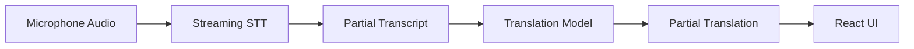

Advantages:

* Independent STT and translation models
* Easier to replace individual components
* Easier debugging
* Can select specialized models

Potential disadvantages:

* Additional processing stage
* Translation may lag behind transcription
* Partial translation stabilization can be complex

---

### 10.2 Architecture B: Unified Speech Translation

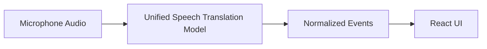

Advantages:

* Potentially lower pipeline complexity
* Model can perform speech translation directly
* Potentially better streaming coordination

Potential disadvantages:

* Model may be larger
* Hardware requirements may be higher
* Model availability and licensing must be evaluated
* Less flexibility than separate STT and translation models

---

## 11. Data Requirements

### 11.1 Initial MVP

The initial MVP shall not require a database.

The following information can remain in memory:

* Active sessions
* Session configuration
* Current model state
* Segment state
* Connection state

---

### 11.2 Future Database

A database may be introduced later for:

* User accounts
* Authentication
* User preferences
* Translation history
* Usage statistics
* Subscription information
* Application configuration

This is outside the scope of the initial MVP.

---

## 12. Authentication Requirements

Authentication is intentionally excluded from the first implementation.

### Future Requirement

The application should eventually support:

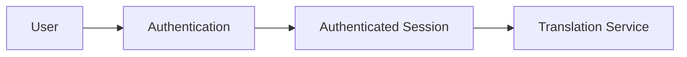

Potential future capabilities:

* Registration
* Login
* Logout
* Password management
* Session/token management
* User-specific settings
* User-specific translation history

The authentication layer should be introduced without requiring major changes to the real-time translation pipeline.

---

## 13. Session Lifecycle

A translation session should follow:

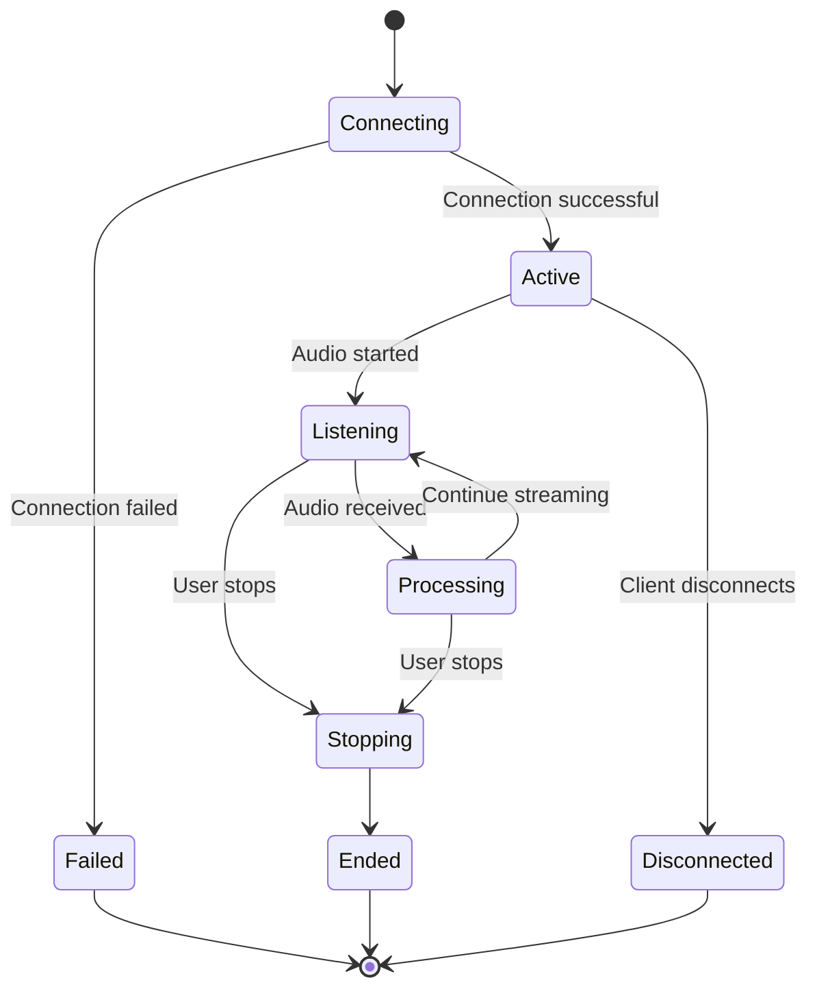

---

## 14. Sequence Diagram

### 14.1 Normal Translation Flow

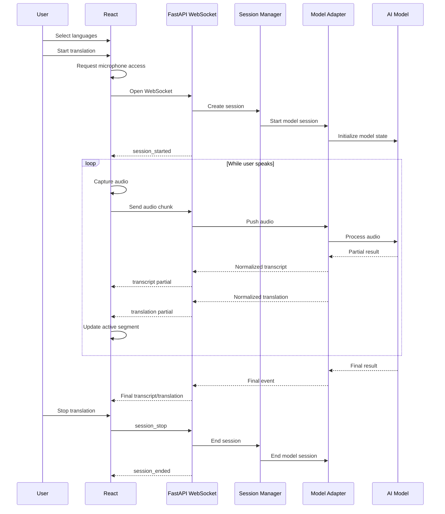

---

## 15. State Management Requirements

The frontend shall maintain at least:

```text
Connection State
Session State
Source Language
Target Language
Transcript Segments
Translation Segments
Current Partial Segment
Error State
```

A conceptual state structure:

```javascript
{
  sessionId: null,

  connection: "disconnected",

  sourceLanguage: "en",
  targetLanguage: "hi",

  segments: [
    {
      id: 1,
      transcript: "...",
      translation: "...",
      status: "final"
    }
  ],

  activeSegment: {
    id: 2,
    transcript: "...",
    translation: "...",
    status: "partial"
  }
}
```

---

## 16. Backend Session Management

The backend shall maintain session-specific state.

Conceptually:

```python
sessions = {
    "session-1": SessionState(...),
    "session-2": SessionState(...),
}
```

However, the implementation should use an appropriate session manager abstraction rather than exposing a global dictionary throughout the application.

A future distributed deployment may require an external session/state mechanism.

---

## 17. API Requirements

The initial system's primary communication mechanism shall be WebSockets.

A possible endpoint:

```text
/ws/translate
```

Connection:

```text
ws://localhost:8000/ws/translate
```

Production:

```text
wss://api.example.com/ws/translate
```

---

### 17.1 WebSocket Client Messages

#### Start Session

```json
{
  "type": "start",
  "source_language": "en",
  "target_language": "hi"
}
```

#### Audio

Audio chunks may be sent as binary WebSocket messages.

```text
Binary PCM Data
```

#### Stop

```json
{
  "type": "stop"
}
```

---

## 18. Backend API Separation

Although the primary real-time interface will use WebSockets, normal HTTP endpoints may be introduced for non-real-time functionality.

For example:

```text
GET /health
GET /languages
```

Future authentication APIs may include:

```text
POST /auth/register
POST /auth/login
POST /auth/logout
```

These are outside the initial MVP.

---

## 19. Health Check

The backend should provide a health endpoint:

```http
GET /health
```

Example:

```json
{
  "status": "ok"
}
```

A more detailed internal health check may later report:

```json
{
  "status": "ok",
  "model": "ready",
  "gpu": true
}
```

---

## 20. Performance Requirements

Performance shall be evaluated using measurable metrics.

Important metrics include:

| Metric                | Description                             |
| --------------------- | --------------------------------------- |
| Audio Capture Latency | Time to capture audio                   |
| Network Latency       | Time to transmit audio                  |
| STT Latency           | Time from audio to transcript           |
| Translation Latency   | Time from transcript to translation     |
| End-to-End Latency    | Speech to displayed translation         |
| Model Processing Time | Time spent in inference                 |
| Throughput            | Number of concurrent sessions           |
| Memory Usage          | RAM consumed per session                |
| GPU Usage             | GPU resources consumed during inference |

---

## 21. Resource Management

The system shall release:

* WebSocket connections
* Audio streams
* Model session state
* Temporary buffers
* GPU resources where applicable

when a translation session terminates.

This is particularly important because AI model inference may consume significant memory.

---

## 22. Security Requirements

### 22.1 Transport Security

Production WebSocket communication shall use:

```text
WSS
```

rather than:

```text
WS
```

---

### 22.2 Input Validation

The backend shall validate:

* Message types
* Session state
* Language codes
* Audio payloads
* Payload sizes

---

### 22.3 Resource Protection

The backend should protect against:

* Excessively large audio messages
* Excessive connection creation
* Invalid message flooding
* Long-running abandoned sessions

Rate limiting and connection limits can be introduced as deployment requirements.

---

## 23. Browser Compatibility

The frontend should target modern browsers supporting:

* WebRTC/media capture APIs
* Web Audio API
* AudioWorklet
* WebSocket
* JavaScript ES modules

The initial supported browsers should include current versions of:

* Chrome
* Edge
* Firefox
* Safari

Exact browser versions can be defined during QA.

---

## 24. Deployment Requirements

The initial system should support local development using:

```text
Frontend
React development server

Backend
FastAPI + Uvicorn

AI Model
Local/self-hosted model
```

Example:

```text
Browser
   |
   +---- localhost:5173
   |
   +---- WebSocket
             |
             v
        localhost:8000
             |
             v
        AI Model Runtime
```

Production deployment can later introduce:

```text
Internet
    |
    v
Reverse Proxy
    |
    +--> React Frontend
    |
    +--> FastAPI Backend
             |
             v
        Model Runtime
```

---

## 25. Logging Requirements

The backend should generate structured logs.

Example:

```text
INFO  session_created
INFO  websocket_connected
INFO  model_session_started
INFO  audio_chunk_received
INFO  transcript_generated
INFO  translation_generated
INFO  session_ended
ERROR model_inference_failed
```

The system shall not log complete raw audio data.

Sensitive user content should also be excluded from logs where possible.

---

## 26. Testing Requirements

### 26.1 Unit Testing

The following should have unit tests:

* Session manager
* Language validation
* Event schemas
* Event normalization
* Model adapter
* Audio processing
* Error handling

---

### 26.2 Integration Testing

Integration tests should verify:

```text
React
  |
  v
WebSocket
  |
  v
FastAPI
  |
  v
Model Adapter
  |
  v
Mock Model
```

---

### 26.3 End-to-End Testing

The system should eventually verify:

```text
Microphone
    |
    v
AudioWorklet
    |
    v
WebSocket
    |
    v
Backend
    |
    v
Model
    |
    v
Translation
    |
    v
UI
```

---

## 27. Acceptance Criteria

The initial MVP shall be considered functional when all of the following are satisfied.

### AC-001

A user can open the application and grant microphone permission.

### AC-002

A user can select source and target languages.

### AC-003

A user can start a translation session.

### AC-004

Microphone audio is continuously streamed to the backend.

### AC-005

The backend receives audio through WebSocket communication.

### AC-006

Speech is converted to text.

### AC-007

Partial transcription appears before the speaker finishes speaking.

### AC-008

Translation is generated incrementally.

### AC-009

Partial translation appears while speech continues.

### AC-010

Partial results are replaced rather than displayed as duplicate lines.

### AC-011

Final transcript and translation remain stable.

### AC-012

Stopping the session stops microphone processing and model processing.

### AC-013

Unexpected WebSocket disconnections clean up backend resources.

### AC-014

Raw audio is not persisted by default.

### AC-015

The system can run using self-hosted/free AI models without requiring a paid external API.

---

## 28. MVP Scope

The first implementation should focus on:

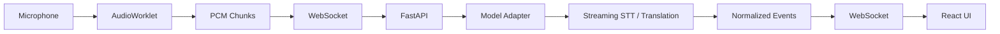

### MVP Includes

* React frontend
* FastAPI backend
* WebSocket communication
* Microphone capture
* Audio chunking
* Streaming audio
* Speech recognition
* Translation
* Partial results
* Final results
* Segment IDs
* Event normalization
* Model adapter
* Session lifecycle
* Basic error handling
* Local/self-hosted model execution

### MVP Excludes

* Database
* Registration
* Login
* User profiles
* Subscription system
* Payment
* Persistent translation history
* Cloud AI APIs
* Advanced analytics
* Admin dashboard

---

## 29. Future Scope

The system may later evolve into:

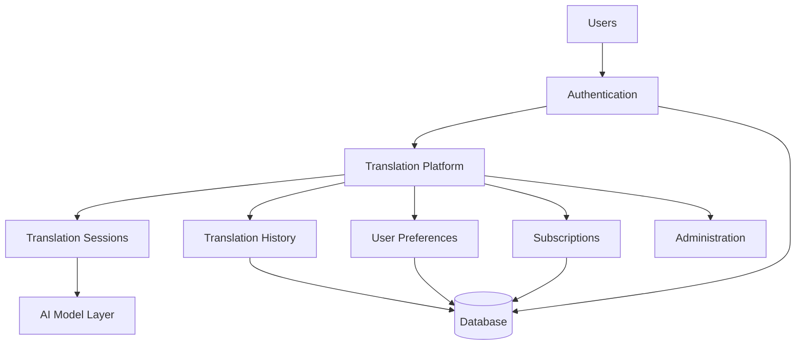

Potential future features include:

* User registration
* Authentication
* User profiles
* Persistent translation history
* Saved language preferences
* Multiple simultaneous sessions
* Conversation export
* Speaker identification
* Voice activity detection
* Automatic language detection
* Text-to-speech translated output
* Browser-to-browser translation
* Mobile application
* Model selection
* Model performance monitoring
* Usage analytics
* Subscription plans

---

## 30. Requirement Traceability

The requirements should eventually be mapped to implementation and testing artifacts.

Example:

| Requirement                | Component           | Test                     |
| -------------------------- | ------------------- | ------------------------ |
| FR-001 Session Start       | Session Manager     | Session creation test    |
| FR-003 Audio Capture       | React Audio Layer   | Browser integration test |
| FR-005 Audio Streaming     | WebSocket Client    | WebSocket test           |
| FR-007 Speech Recognition  | Model Adapter       | STT integration test     |
| FR-010 Translation         | Translation Adapter | Translation test         |
| FR-012 Partial Replacement | React State         | UI state test            |
| FR-018 Session Termination | Session Manager     | Cleanup test             |
| NFR-001 Low Latency        | Entire Pipeline     | Latency benchmark        |
| NFR-005 Security           | Backend/WebSocket   | Security tests           |
| NFR-006 Privacy            | Audio Pipeline      | Storage verification     |

---

## 31. Requirements Priority

Requirements can be prioritized using:

* **P0:** Mandatory for MVP
* **P1:** Important but can follow immediately after MVP
* **P2:** Future enhancement

| Requirement             | Priority |
| ----------------------- | -------- |
| Microphone capture      | P0       |
| Audio streaming         | P0       |
| WebSocket communication | P0       |
| Streaming STT           | P0       |
| Translation             | P0       |
| Partial results         | P0       |
| Final results           | P0       |
| Segment management      | P0       |
| Model adapter           | P0       |
| Session management      | P0       |
| Error handling          | P0       |
| Language selection      | P0       |
| Database                | P2       |
| Authentication          | P2       |
| User profiles           | P2       |
| Translation history     | P2       |
| Subscriptions           | P2       |
| Admin dashboard         | P2       |

---

## 32. Relationship With Other Project Documents

The project documentation should be organized so that each document answers a different question:

```text
BRD
 |
 | Why are we building this?
 v
PRD
 |
 | What should the product do?
 v
SRS
 |
 | What exact software requirements must be implemented?
 v
TRD / TDD
 |
 | How will those requirements be technically implemented?
 v
Implementation
 |
 v
Testing / QA
```

